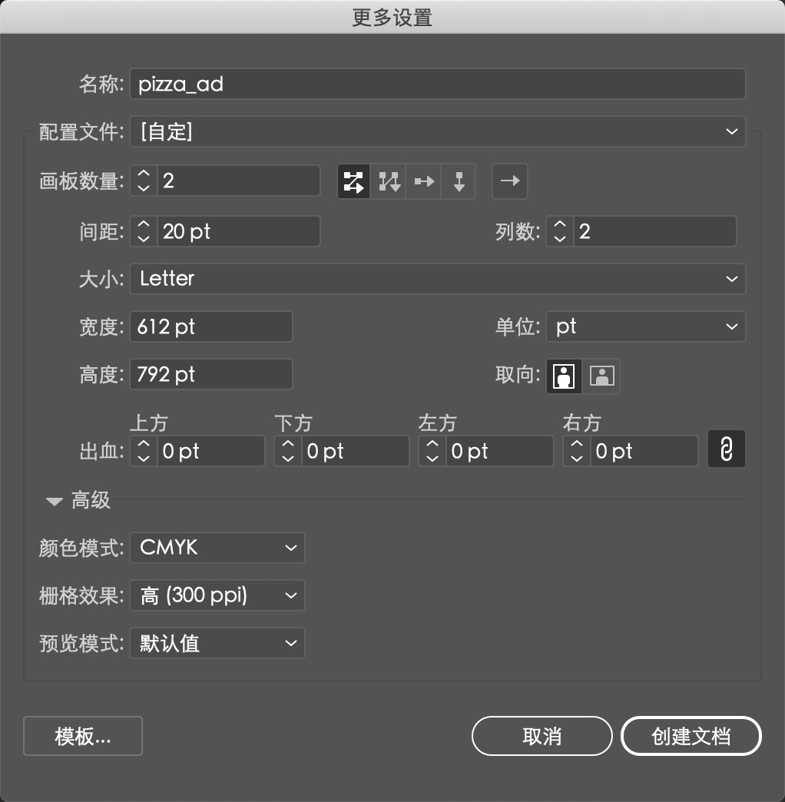
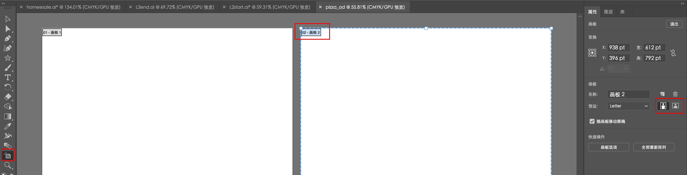
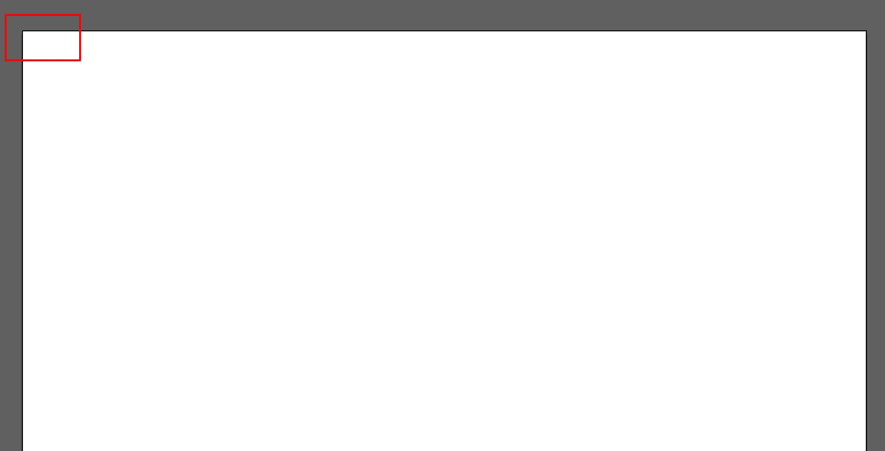

[toc]

# 1. 创建文档

Illustrator 文档中最多可包含100个画板（与 Adobe InDesign 中的 “页面” 相似）。下面需要创建一个包含两个画板的文档。

1. 选择 ”窗口“ > “工作区” > “重置基本功能”。
2. 选择 ”文件“ > ”新建“。
3. 在新文档对话框中，改变以下选项（其余选项保持默认设置）：
    - 名称：pizza_ad
    - 画板属性：2
    - 大小：Letter
单击 “确定” 按钮，出现一个新的空白文档。

4. 选择 “文件” > “存储为”。在该对话框中，保留 “保存类型” 为 Adobe Illustrator (\*.AI) (Windows 系统) 或 “格式” 为 Adobe Illustrator (ai) (Mac 系统)，单击 “保存” 按钮。而 “Illustrator 选项” 对话框均接受默认设置，单击 “确定” 按钮。

5. 选择 “视图” > “标尺” > “显示标尺”，以便在文档窗口显示标尺。

6. 选择左边工具箱中的 ”画板“ 工具。单击 ”02-画板 2“ （标签在左上角）中央。在画板上方的控制画板中，单击 ”横向“ 按钮。

7. 将鼠标放至选中的画板，向右拖曳直至两个画板中间出现灰色区域。Illustrator 允许存在不同大小和方向的画板。

8. 在工具箱中选择 ”选择工具“，退出画板编辑模式。单击右侧画板，将其设为活动画板。

9. 选择 ”视图“ > "画板适合窗口大小"。

# 2. 创建形状

多样化的形状是 Illustrator 的基石，在本书中还将会创建很多形状。下面，将会创建几个常见的形状。

1. 选择 ”矩形工具”， 将鼠标放至画板的左上角（如图中的 “X” 处）。当鼠标旁出现 ”交叉“ 的字样时，单击并将鼠标拖曳至画板右侧。当灰度尺标签显示宽为 792pt，高为 400pt 时，松开鼠标。结果大致正确即可。

2. 单击”矩形工具“，再按住该按钮。单击选择 ”多边形工具”。
3. 在画板的大致中央位置单击，出现多边形对话框，将半径改为 200pt，边数改为 3。单击 “确定” 按钮后创作出三角形，视作一块披萨饼。

# 3. 使用颜色

