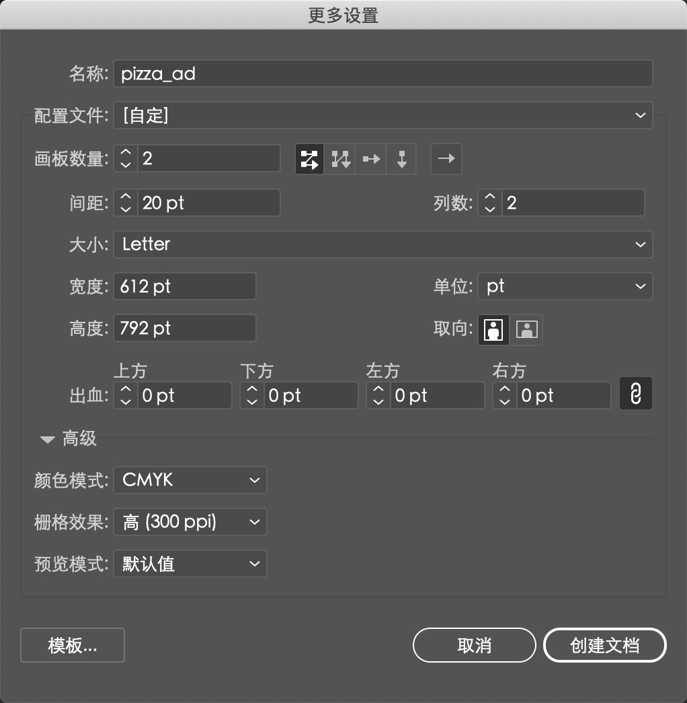
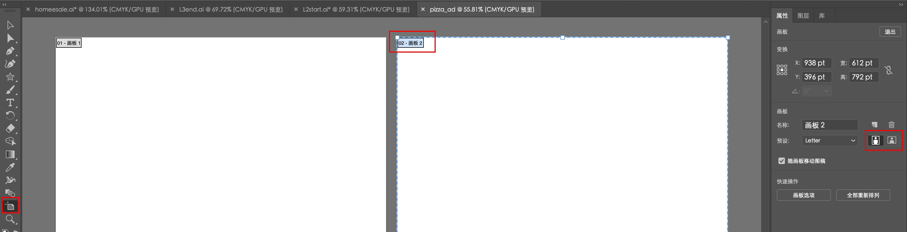
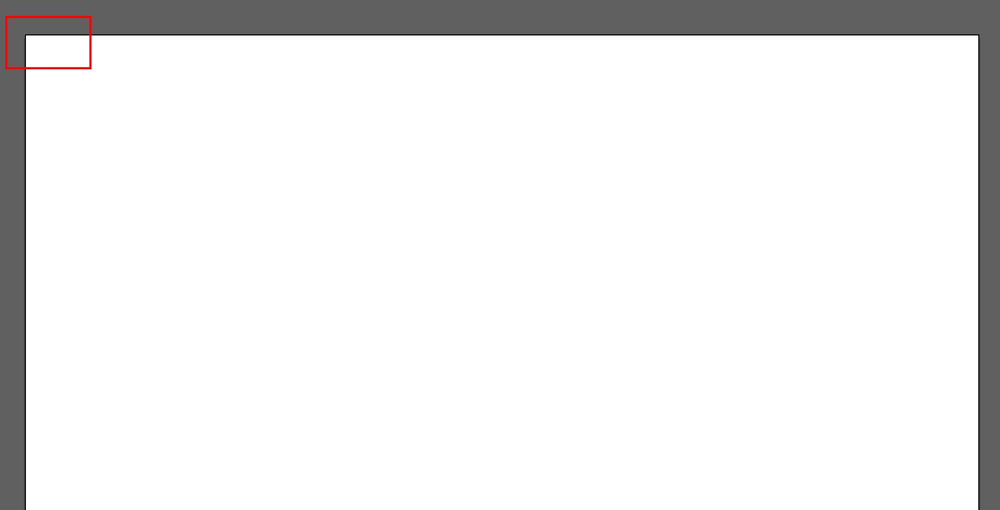
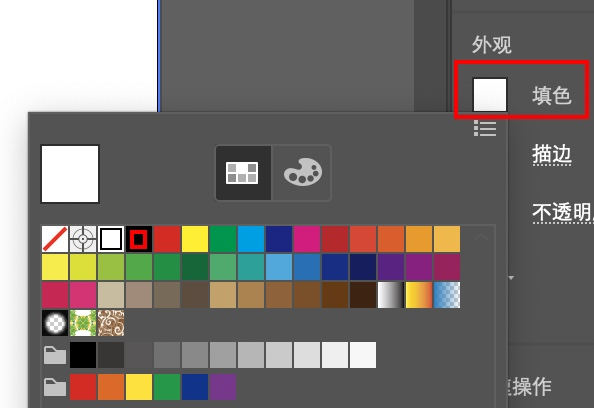
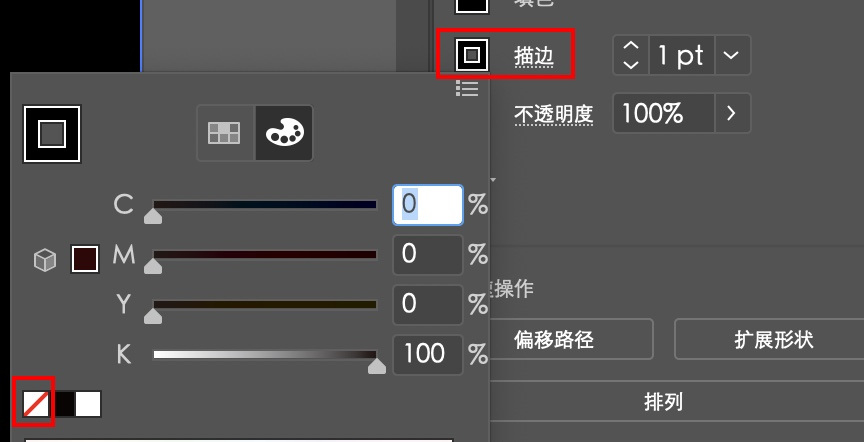
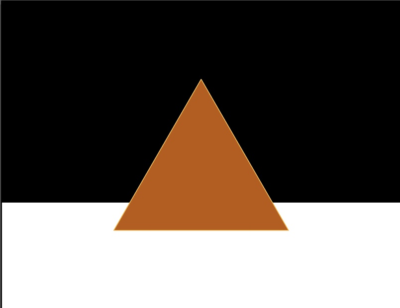

[toc]

# 1. 创建文档

Illustrator 文档中最多可包含100个画板（与 Adobe InDesign 中的 “页面” 相似）。下面需要创建一个包含两个画板的文档。

1. 选择 ”窗口“ > “工作区” > “重置基本功能”。
2. 选择 ”文件“ > ”新建“。
3. 在新文档对话框中，改变以下选项（其余选项保持默认设置）：
    - 名称：pizza_ad
    - 画板属性：2
    - 大小：Letter
单击 “确定” 按钮，出现一个新的空白文档。

4. 选择 “文件” > “存储为”。在该对话框中，保留 “保存类型” 为 Adobe Illustrator (\*.AI) (Windows 系统) 或 “格式” 为 Adobe Illustrator (ai) (Mac 系统)，单击 “保存” 按钮。而 “Illustrator 选项” 对话框均接受默认设置，单击 “确定” 按钮。

5. 选择 “视图” > “标尺” > “显示标尺”，以便在文档窗口显示标尺。

6. 选择左边工具箱中的 ”画板“ 工具。单击 ”02-画板 2“ （标签在左上角）中央。在画板上方的控制画板中，单击 ”横向“ 按钮。

7. 将鼠标放至选中的画板，向右拖曳直至两个画板中间出现灰色区域。Illustrator 允许存在不同大小和方向的画板。

8. 在工具箱中选择 ”选择工具“，退出画板编辑模式。单击右侧画板，将其设为活动画板。

9. 选择 ”视图“ > "画板适合窗口大小"。

# 2. 创建形状

多样化的形状是 Illustrator 的基石，在本书中还将会创建很多形状。下面，将会创建几个常见的形状。

1. 选择 ”矩形工具”， 将鼠标放至画板的左上角（如图中的 “X” 处）。当鼠标旁出现 ”交叉“ 的字样时，单击并将鼠标拖曳至画板右侧。当灰度尺标签显示宽为 792pt，高为 400pt 时，松开鼠标。结果大致正确即可。

2. 单击”矩形工具“，再按住该按钮。单击选择 ”多边形工具”。
3. 在画板的大致中央位置单击，出现多边形对话框，将半径改为 200pt，边数改为 3。单击 “确定” 按钮后创作出三角形，视作一块披萨饼。

# 3. 使用颜色

对作品着色是 Illustrator 中的常见操作。通过使用颜色面板、色板、颜色参考面板和 ”重新着色图稿“ 对话框可以轻易地尝试和应用各种颜色。

1. 在左侧工具箱中选择 ”选择工具“，单击之前画出的矩形中的某个位置，以此选中该矩形。

2. 单击控制面板中的 ”填色“ 以显示色板。选中色板位于首行的黑色样本，出行 “黑色” 提示后，单击并应用该样本填色。按 <kbd>Esc</kbd> 键隐藏该色板。

    

3. 单击控制面板中的 ”描边色“ 以显示色板。单击 ”[无]“ 删除矩形的描边（边框）。按 <kbd>Esc</kbd> 键隐藏该色板。

    

4. 单击三角形白色区域的任何位置，以此选中该区域。

5. 双击工具箱底部的白色填色框，在 “设色器” 对话框中，将 CMYK 的值改为 C=5，M=70，Y=100，K=25。单击 “确定” 按钮，于是一种新的颜色成功填充到三角形中。

6. 单击控制面板中的 ”描边色“。选择提示为 ”C=0 M=35 Y=85 K=0“ 的浅橘色，用来对三角形描边。

7. 选择 “文件” > “保存”，下个阶段再处理这个三角形。 

    

# 4. 编辑描边

为了改变描边的颜色，还可以使用其他方式设计它的格式。接下来是处理这个三角形。

1. 选中三角形，单击控制面板中带下划线的 “描边”，以此打开描边面板。将描边粗细改为 3 pt。按 Esc 键隐藏该描边面板。
2. 使用 “选择工具”，转换选中黑色矩形。选择 “对象” > “隐藏” > “所选对象”，暂时隐藏该矩形和三角形。

# 5. 使用形状生成器工具创建形状

形状生成器是一种交互式工具，可以通过合并和擦除简单的形状来创建复杂的形状。下面将通过使用形状生成器完成城市的一处空中轮廓线。

1. 选择 “文件” > “打开”，然后打开位于 Lesson00 文件夹中的 city.ai 文件。

    该文件包含了一些通过合并生成的形状，从而得到单个的城市图形。这一节通过使用形状生成器添加一座建筑、增加一些窗口，来完成这个图形。

2. 选择 ”视图“ > ”画板适合窗口大小“。

3. 使用 ”选择工具“，选中右边远处的建筑。按住 <kbd>Shift</kbd> 键，将该建筑拖至左侧，直到其左侧边缘与城市图形的右侧边缘 “撞上”，这时释放鼠标和 <kbd>Shift</kbd> 键。

4. 选择菜单 “选择” > “现用画板上的所有对象”，这样选中所有图形。

    大的城市图形和单个建筑都已选中，但仍需注意的是，有一栋建筑上的 3 个矩形将要做成窗户。

5. 选择 “形状生成器工具”，将鼠标放至所有选中图形的右侧，然后将鼠标拖至左侧大的城市图形处，释放鼠标。

    这步操作将两个图形合并为一个整体图形。

6. 将鼠标放在将要做成窗户的一个小矩形上。按住 <kbd>Alt</kbd> 键（Windows 系统）或 <kbd>Option</kbd> 键（Mac 系统）。当该填充处出现网状结构（不是红色描边）时，单击即可将该处形状从整个图形中删去。继续按住 <kbd>Alt</kbd> 键（Windows 系统）或 <kbd>Option</kbd> 键（Mac 系统），将另外两处窗户形状的填充区也删去。

7. 选择 ”选择工具“，确保这个城市轮廓线图形被选中。选择菜单 ”编辑“ > ”复制“。

8. 选择 ”文件“ > ”退出“，不需保存文件。

9. 选择 “编辑” > “粘贴”，返回 pizza_ad.ai 文件，将图形粘贴至文档窗口中央。

10. 使用 “选择工具”，单击选中图形并将其拖曳到画板上部即可。同时，尽量保持图形在画板水平的中间位置。

拖曳时，可以看到绿色的参考线和灰色的度量标签。这是稍后课程中会出现的智能参考线。