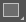
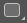
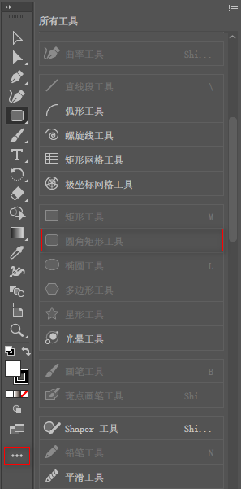
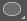
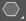

[toc]

### 1. 绘制矩形和正方形

矩形工具用来创建矩形和正方形。选择该工具后，点击并拖曳鼠标可以创建任意大小的矩形；按住 <kbd>Alt</kbd> 操作，可由单击点为中心向外绘制矩形；按住 <kbd>Shift</kbd> 键，可绘制正方形；按住 <kbd>Shift</kbd> + <kbd>Alt</kbd> 键，可由单击点为中心向外绘制正方形。如果要创建一个指定大小的图形，可以在画板中单击，打开 "矩形" 对话框设置参数。

### 2. 绘制圆角矩形

圆角矩形工具 用来创建圆角矩形。它的使用方法及快捷键都与矩形工具相同。不同的是，在绘制过程中按下 <kbd>↑</kbd> 键，可增加圆角半径直至成为圆形；按下 <kbd>↓</kbd> 键可减少圆角半径直至成为方形；按下 <kbd>←</kbd> 键或 <kbd>→</kbd> 键，可以在方形与圆形之间切换。如果要绘制指定大小的圆角矩形，可在画板中单击，打开 ”圆角矩形“对话框设置参数。

> 提示：如果在工具面板中的矩形工具组合中没有看到圆角矩形工具，可以点击工具面板下面的更多按钮，在更多列表中找到圆角矩形工具并将其拖至矩形工具组合中，即可。
>
> 

### 3. 绘制圆形和椭圆形

椭圆形工具  用来创建圆形和椭圆形。选择该工具后，单击并拖曳鼠标可以绘制任意大小的椭圆；按住 <kbd>Shift</kbd> 键可创建圆形；按住 <kbd>Alt</kbd> 键，可由单击点为中心向外绘制椭圆；按住 <kbd>Shift</kbd> + <kbd>Alt</kbd> 键，则由单击点为中心向外绘制圆形。如果要创建指定大小的椭圆形或圆形，可在画板中单击，打开 ”椭圆“ 对话框设置参数。

### 4. 绘制多边形

多边形工具  用来创建三边和三边以上的多边形。在绘制过程中，按下 <kbd>↑</kbd> 键或  <kbd>↓</kbd> 键，可增加或减少多边形的边数；移动光标可以旋转多边形；按住 <kbd>Shift</kbd> 键操作可以锁定一个不变的角度。如果要指定多边形的半径和边数，可在希望作为多边形中心的位置单击，打开 ”多边形“ 对话框进行设置。

### 5. 绘制星形

星形工具  用来创建各种形状的星形。在绘制过程中，按下 <kbd>↑</kbd> 键或  <kbd>↓</kbd> 键可增加或减少星形的角点数；拖曳鼠标可以旋转星形；如果要保持不变的角度，可按住 <kbd>Shift</kbd> 键来操作；如果按下 <kbd>Alt</kbd> 键，则可以调整星形拐角的角度。

如果要更加精确地绘制星形，可以使用星形工具  在希望作为星形中心的位置单击，打开 ”星形“ 对话框进行设置。

+ 半径1：用来指定从星形中心到星形最内点的距离。
+ 半径2：用来指定从星形中心到星形最外点的距离。
+ 角点数：用来指定星形具有的点数。