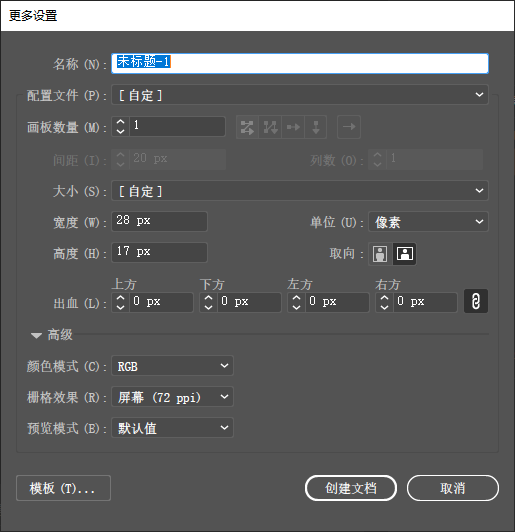

+ 名称：按作品起名称
+ 画板数量：AI可以同时建立多个文档。
+ 单位：点开有多个单位可选，互联网单位：像素、印刷单位：毫米，厘米等
+ 取向：文档的横向和纵向使用选择
+ 出血：印刷中，为后期裁切纸张时不留白边，所以在制作文档时，每边多出 3mm；互联网作品制作，不需要出血
+ 栅格效果：矢量图建立画布时，与分辨率无关，这里的分辨率是指矢量图转换Wi位图时使用的分辨率

1. 新建快捷键：<kbd>Ctrl</kbd>+ <kbd>N</kbd>
2. 不同行业画布建立（印刷中有 3 毫米出血）
3. 矢量图建立画布与分辨率无关（高级中的分布率指的是，矢量图转换为位图使用的）