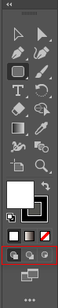

在 Illustrator 中绘图时，新创建的图形会堆叠在原有图形的上方。如果想要改变这种绘图方式，可先单击工具面板底部的绘图模式按钮，然后再绘图。

+ 正常绘图：默认的绘图模式，新创建对象总是位于最顶部。
+ 背面绘图：在没有选择画板的情况下，可在所选图层的最底部绘图。如果选择了画板，则在所选对象的下方绘制新对象。
+ 内部绘图：选择一个对象，单击该按钮后，可在所选对象内部绘图。通过这种方式可以创建剪切蒙版，使新绘制的对象显示在所选对象的内部。

**技术看板：两种剪切蒙版的区别**

通过内部绘图模式创建的剪切蒙版会保留剪切路径上的内容，而使用 `对象` -> `剪切蒙版` -> `建立` 命令创建的剪切蒙版则会隐藏这些内容。