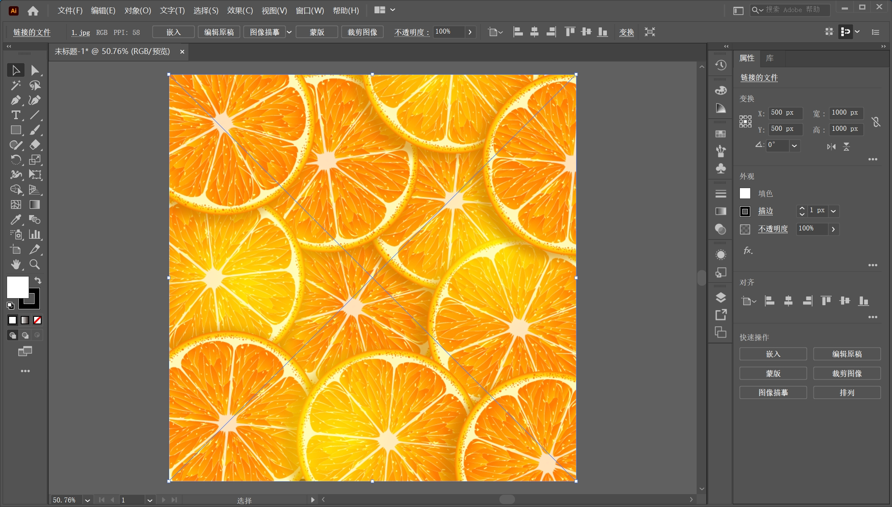

[toc]

> 提示：资源文件路径：百度网盘 -> 《中文版Illustrator 2022完全案例教程》- 资源包 -> 2.配套素材 -> 2. 绘制简单的图形 -> 使用圆角矩形绘制APP图标

### 案例效果

案例效果如下图所示：

### 操作步骤

**步骤 01** 执行 `文件` -> `新建` 命令，在弹出的 `新建文档` 窗口中设置 `宽度` 和 `高度` 数值均为 `1000px`，`颜色模式` 为 `RGB颜色`。设置完成后单击 `确定` 按钮。

**步骤 02** 将背景素材置入画面。执行 `文件` -> `置入` 命令，将背景素材 `1.jpg` 置入画面，使其充满整个画板，如下图所示。然后在选中图片的状态下单击控制栏中的 `嵌入` 按钮将其嵌入。

**步骤 03** 在文档中绘制 `App` 图标。选择工具箱中的 `圆角矩形工具` ，接着设置填充色，接着单击 `颜色` 按钮设置 `填充类型` 为纯色，然后双击 `填色` 按钮，在弹出的 `拾色器` 窗口中设置颜色为橄榄绿 `618432` 。设置完成后单击 `确定` 按钮，如下图所示。

**步骤 04** 颜色设置完成后，在控制栏中设置 `描边` 为无。设置完成后在画面中按住 <kbd>Shift</kbd> 键的同时按住鼠标左键拖动绘制一个正圆角矩形，如下图所示。

**步骤 05** 此时，圆角矩形的圆角弧度较小，需要将其调大一些。使用 `选择工具` 将圆角矩形选中，然后将光标放在挑中圆角的圆点上，按住鼠标左键向右下角拖动，如下图所示。

**步骤 06** 在画面中添加其他符号。执行 `窗口` -> `符号库` -> `网页图标` 命令，在弹出的 `网页图标` 窗口中选择 `电子邮件` 符号，然后按住鼠标不放将其拖到画面中，如下图所示。释放鼠标即可将该符号添加到画面中。

**步骤 07** 因为该符号处于链接的状态，所以要将其断开链接后更改颜色，然后再进行操作。选择该符号，在控制栏中单击 `断开链接` 按钮。

**步骤 08** 将其链接断开，此时在控制栏中就可以看到符号被填充为黑色。

**步骤 09** 将符号移至画面的中间位置，并在控制栏中将其 `填充` 更改为 `白色` ，此时本案例制作完成。