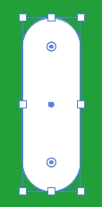
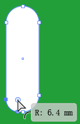
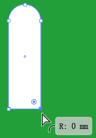
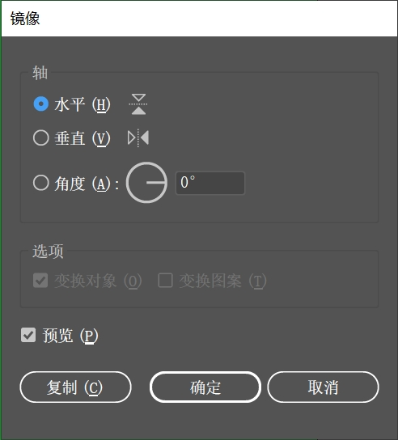
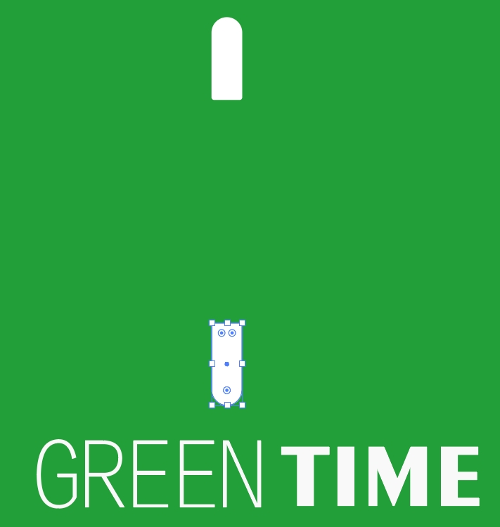
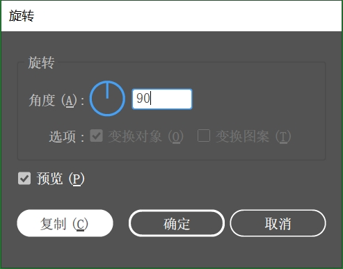
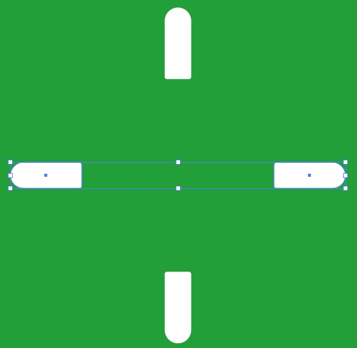
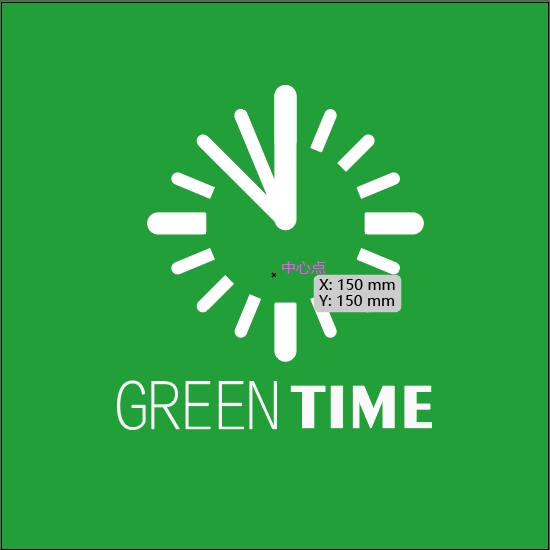

> 提示：资源文件路径：百度网盘 -> 《中文版Illustrator 2022完全案例教程》- 资源包 -> 2.配套素材 -> 2. 绘制简单的图形 -> 改变转角类型制作钟表标志

### 案例效果

案例效果如下所示：

### 操作步骤

**步骤 01** 执行 `文件` -> `打开` 命令，将素材 `1.ai` 打开，如下图所示。

**步骤 02** 选择工具箱中的 `圆角矩形工具`，在控制栏中设置 `填充` 为白色，`描边` 为无。设置完成后在画面中绘制图形，如下图所示。

**步骤 03** 从案例效果可以看出圆角矩形的一端为平角，所以需要对绘制好的图形进行调整。选择图形，选择工具箱中的 `直接选择工具`，将光标放在图形左下角拖动。直至该角调整为没有弧度的直角。效果如下所示。

**步骤 04** 使用同样的方法对另外一个角进行操作，效果如下所示。

**步骤 05** 选择绘制完成的圆角矩形，执行 `对象` -> `变换` -> `镜像` 命令，在弹出的 `镜像` 窗口中选中 `水平` 单选按钮，接着单击 `复制` 按钮，如下图所示，即可将原有图形进行水平对称并复制一份。

​                                          

**步骤 06** 选择复制得到的图形，按住 <kbd>Shift</kbd> 键的同时按住鼠标左键将其向下垂直拖动，效果如下所示。

**步骤 07** 按住 <kbd>Shift</kbd> 键依次单击加选这两个图形，执行 `对象` -> `变换` -> `旋转` 命令，在弹出的 `旋转` 窗口红设置 `角度` 为 90°。设置完成后单击 `复制` 按钮，效果如下所示。

    

**步骤 08** 使用同样的方法制作其他的圆角矩形，让其组成一个圆环作为钟表的外轮廓，如下所示。

**步骤 09** 制作指针。继续使用 `圆角矩形工具`，给绘制一个细长的圆角矩形作为指针。

**步骤 10** 继续绘制一个稍细一些的圆角矩形。

**步骤 11** 将光标放在图形一角处以外的位置，此时光标变为带有弧角的双箭头，按住鼠标左键并拖动即可旋转，并将其移到合适的位置。

**步骤 12** 使用同样的方法制作另外一个指针，此时本案例制作完成。

