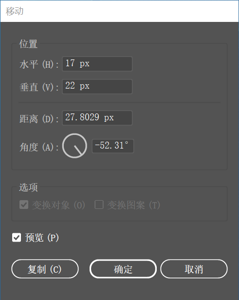

1. 使用快捷键 <kbd>Ctrl</kbd> + <kbd>R</kbd> 打开标尺。

2. 将光标放置在左侧的垂直标尺上，然后按住鼠标左键向右拖动，释放鼠标后即可创建垂直参考线。

3. 如果要精确地调整参考线的位置，可以使用 "选择工具" 在参考线上方单击将其选中，然后按下 <kbd>Enter</kbd> 键打开 "移动" 对话框，在对话框中 "水平" 和 "垂直" 输入框中输入移动位置。

   

4. 将光标定位水平标尺上，然后按住鼠标左键向下拖动，即可拖出水平参考线。

5. 使用 "移动工具" 在参考线上单击，当参考线变为淡蓝色后按 <kbd>Delete</kbd> 键，即可将其删除。如果需要删除画布中的所有参考线，可以执行 "视图 > 参考线 > 清除参考线" 命令。

   > 提示：Illustrator 中的参考线不仅可以是垂直或水平的，也可以将矢量图形转换为参考线对象。可以先绘制一个形状。选中这个图形，然后按快捷键 <kbd>Ctrl</kbd> + <kbd>5</kbd>，即可将这个图形转换为参考线。

6. 参考线非常容易由于错误操作而导致位置发生变化，所以在创建参考线后可以将其锁定。执行 "视图 > 参考线 > 锁定参考线" 命令，即可将当前的参考线锁定。

   > 提示：在移动、变换或创建新图形时，经常会感受到对象被自动 "吸附" 到另一个对象的边缘或某些特定位置，这是因为开启了 "对齐" 功能。执行 "视图" 菜单下的对齐像素、对齐点命令，可以设置 "对齐" 功能的开启与关闭。

   