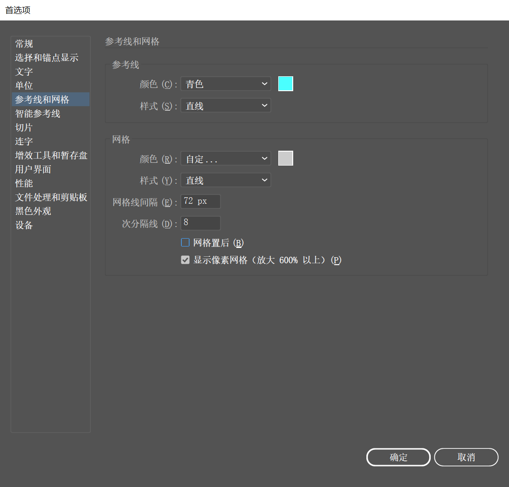

1. 执行 "视图 > 显示网格" 命令（快捷键为 <kbd>Ctrl</kbd> + <kbd>'</kbd>），就可以在画布中显示出网格。

2. 为了使网格能够在图像上方显示，需要打开 "首选项" 窗口进行设置。执行 "编辑 > 首选项 > 参考线和网格" 命令，在打开的 "首选项" 窗口 "参考线和网格" 选项卡中取消勾选 "网格置后" 复选框，然后单击 "确定" 按钮。

   

3. 此时，网格会在画面顶部显示，这样就能够根据网格调整对象位置。

4. 使用快捷键 <kbd>Ctrl</kbd> + <kbd>'</kbd> 隐藏网格。

   > 提示：默认情况下参考线为青色，智能参考线为洋红色，网格为灰色。如果正在编辑的文档与这些辅助对象的颜色非常相似，则可以更改参考线和网格的颜色。执行 "编辑 > 首选项 > 参考线和网格" 命令，在弹出的 "首选项" 窗口中可以选择合适的颜色，还可以选择线条类型。