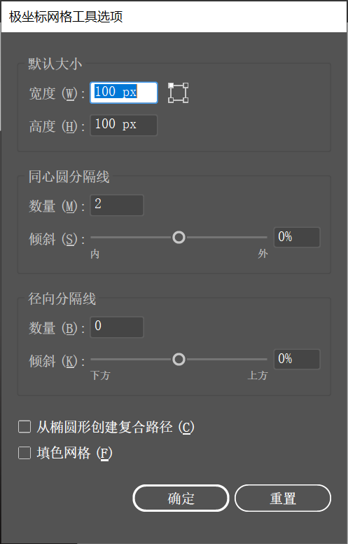
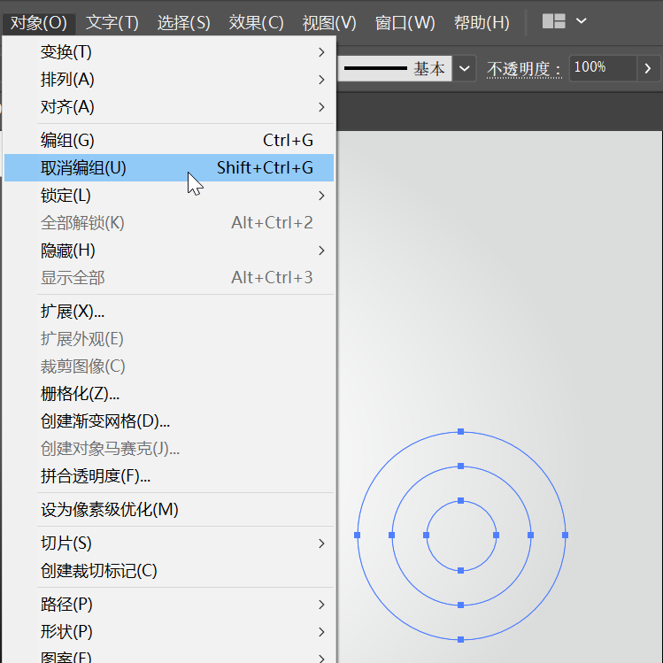
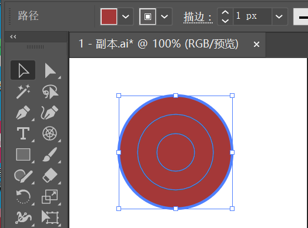

> 提示：资源文件路径：百度网盘 -> 《中文版Illustrator 2022完全案例教程》- 资源包 -> 2.配套素材 -> 2. 绘制简单的图形 -> 使用极坐标网格工具绘制小图标 -> 素材 -> 1.ai

`极坐标网格工具`  位于线条工具组中。使用 `极坐标网格工具` 可以快速绘制出由多个同心圆的直线组成的极坐标网格，适合制作同心圆、射击靶等对象。

**实例：使用 “极坐标网格工具” 绘制小图标**

**实例说明**

使用 `极坐标网格工具` 可以很方便地绘制多个同心圆，再通过执行 `取消编组` 命令的操作可以更改各个同心圆的颜色，达到更加丰富的效果。本案例主要通过使用 `极坐标网格工具` 绘制得到多个同心圆，再通过 `取消编组` 命令取消编组，更改各个同心圆的颜色制作小图标。

**案例效果**

案例效果如下所示：

**操作步骤**

**步骤 01** 执行 `文件` -> `打开` 命令，将素材 `1.a` 打开，如下图所示：

**步骤 02** 使用 `极坐标网格工具` 制作构成小图标的同心圆。选择工具箱中的 `极坐标网格工具` ，在控制栏中设置 `填充` 为 `无`，`描边` 为 `深灰色`，`粗细` 为 `1pt`。设置完成后在画面中单击，在弹出的 `极坐标网格工具选项` 窗口中设置 `宽度` `高度` 均为 `100mm`，`同心圆分隔线` 的 `数量` 为 2，`径向分隔线` 的 `数量` 为 0。设置完成后单击 `确定` 按钮。

> 提示：`极坐标网格工具` 小技巧
>
> 将鼠标移至极坐标网格的控制点上，按住拖动鼠标的同时，按住 <kbd>Shift</kbd> 键，可以定义绘制的极坐标网格为正圆形网格。
>
> 拖动鼠标的同时，按向上或向下的箭头键可以调整经线数量；按向左或向右的箭头键可以调整纬线数量。

**步骤 03** 在案例效果中，每个同心圆都被填充了颜色，但是没有描边效果。此时绘制的同心圆是一个整体，没有办法操作，这是因为整个图形处于编组的状态，所以需要将其编组取消，然后再选择每个独立的同心圆进行操作。选择绘制完成的极坐标图像，执行两次 `对象` -> ` 取消编组` 命令，将其编组取消。

**步骤 04** 使用 `选择工具`，选择最外围的大圆，将 `填充` 设置为 `深红色`，`描边` 设置为无。

**步骤 05** 使用同样的方法对其余两个同心圆进行填充与描边的更改，然后依次加选三个同心圆，将其移至画板中间位置，此时本案例制作完成。

