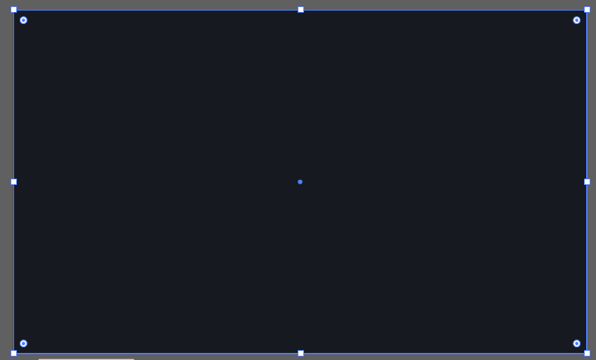

> 提示：资源文件路径：百度网盘 -> 《中文版Illustrator 2022完全案例教程》- 资源包 -> 2.配套素材 -> 2. 绘制简单的图形 -> 企业网站宣传图 -> 素材 -> 1.ai

**实例说明**

使用 `矩形工具` 不仅可以绘制直角的矩形，同时也可以通过各个角的弧度进行调整，制作出各种弧度的圆角矩形，让矩形的效果更加丰富。

**案例效果**

案例效果如下所示：

**操作步骤**

**步骤 01** 执行 `文件` -> `打开` 命令，将素材 `1.ai` 打开。

**步骤 02** 使用 `矩形工具` 在画面中绘制背景。选择工具箱中的 `矩形工具`，在控制栏中设置 `填充` 为 `深灰色`，`描边` 为 `无`。设置完成后在画面中按住鼠标左键拖动绘制一个与画板等大的矩形。

**步骤 03** 继续使用 `矩形工具`，绘制一个稍小一些的矩形。

**步骤 04** 此时，作为背景的两个矩形绘制完成，接着绘制画面最右侧的几个矩形。从案例效果可以看出最右侧的几个矩形，一侧带有圆角，而另一侧则没有圆角。所以这就需要对角进行单独操作。单击工具箱中的 `矩形工具` 按钮，设置 `填充` 为 `蓝色`，`描边` 为 `无`。设置完成后在画面中绘制矩形。

**步骤 05** 更改矩形左侧两个角的弧度。选择工具箱中的 `直接选择工具`，按住 <kbd>Shift</kbd> 键的同时单击矩形左上角和左下角的圆形控制点进行加选。

**步骤 06** 按住鼠标左键不放，向矩形内侧拖动，同时调整左上角和左下角的圆角半径。

**步骤 07** 使用快捷键 <kbd>Ctrl</kbd> + <kbd>C</kbd> 将该矩形复制，并使用 4 次快捷键 <kbd>Ctrl</kbd> + <kbd>V</kbd>，粘贴出另外 4 个矩形，放在已有矩形的下方位置。然后依次加选各个矩形，在控制栏中单击 `右对齐` `垂直居中布局` 按钮，设置对齐方式。

**步骤 08** 选择最后一个矩形，在控制栏中将其 `填充` 更改为 `橘色`。

**步骤 09** 将人物素材置入文档。执行 `文件` -> ` 置入` 命令，在弹出的 `置入` 窗口中单击选择素材 `2.png`，接着单击 `确定 ` 按钮。

**步骤 10** 在画面中单击，将素材置入画面。

**步骤 11** 此时，置入的素材带有交叉的定界框，需要将素材嵌入文档，这样可以防止素材被删除时文档中的素材丢失。选择人物素材，在控制栏中单击 `嵌入` 按钮。

**步骤 12** 此时，该素材已经被嵌入画面。然后适当调整素材的位置。

**步骤 13** 使用 `选择工具` 将画板外的文字移至画面中并调整到合适的位置，此时本案例制作完成。

