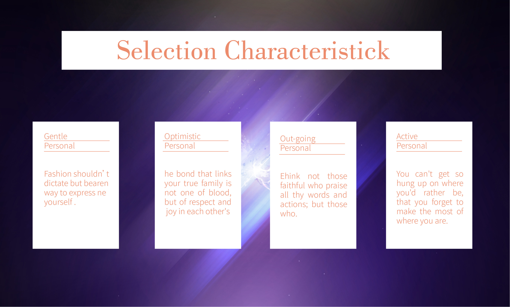

> 提示：资源文件路径：百度网盘 -> 《中文版Illustrator 2022完全案例教程》- 资源包 -> 2.配套素材 -> 2. 绘制简单的图形 -> 使用矩形工具制作简单版式 -> 素材 -> 1.ai

`矩形工具`  主要用于绘制长方形对象和正方形对象。

**实例：使用 "矩形工具" 制作简单版式**

**实例说明**

当前案例选择的背景图颜色较深，为了使文字信息能够更加清晰地呈现在版面中，本案例需要使用 `矩形工具` 绘制矩形作为文字底色，让文字效果更加突出的同时，也让整体版面更加整齐有序。

**案例效果**

案例效果图如下所示：

**操作步骤**

**步骤 01** 执行 `文件` -> `打开` 命令，将素材 `1.ai` 打开。首先绘制画面上方的矩形，选择工具箱中的 `矩形工具`，在控制栏中设置 `填充` 为 `白色`，`描边` 为 `无`。设置完成后在画面中按住鼠标左键拖动绘制矩形。

**步骤 02** 继续使用该工具，在画面左下角继续绘制矩形。

**步骤 03** 从案例效果可以看到，画面下方的 4 个矩形是完全一样的，所以其他三个矩形可以通过复制粘贴的方式得到。选择画面左下角的矩形，使用快捷键 <kbd>Ctrl</kbd> + <kbd>C</kbd> 将其复制一份，使用快捷键 <kbd>Ctrl</kbd> + <kbd>V</kbd> 进行粘贴并适当地移动位置。

**步骤 04** 使用同样的方法再次复制另外两个矩形，将其放置在画面右边位置。

**步骤 05** 对画面下方 4 个矩形的对齐方式进行调整。按住 <kbd>Shift</kbd> 键依次单击加选 4 个矩形，在控制栏中单击 `顶对齐` `水平居中分布` 按钮，设置对齐方式。

**步骤 06** 将文字移至画面中，使用 `选择工具` 将文字移至画面中，将其放置在矩形上方。

**步骤 07** 在画面中添加一些直线，让文字与文字之间的分隔明显一些。选择工具箱中的 `直线段工具`，在控制栏中设置 `填充` 为 `无`，`描边` 为 `红色`（文字颜色一样），`粗细` 为 `0.5pt`。设置完成后在画面左边的文字中间按住 <kbd>Shift</kbd> 键的同时按住鼠标左键拖动绘制一条水平的直线。

**步骤 08** 将该直线进行复制，放在其他文字中间，此时本案例制作完成。