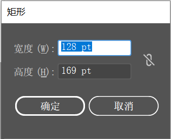

想要绘制特定参数的矩形，可以单击工具箱中的 `矩形工具` 按钮，在要绘制矩形对象的一个角点位置单击，会弹出 `矩形` 窗口。

+ 宽度：定义绘制矩形网格对象的宽度。
+ 高度：定义绘制矩形网格对象的高度。
+ 约束宽度和高度比例按钮：用来设置宽度和高度的比例。首先需要设定一个长宽比，如 `宽度` 为 1，`高度` 为 2。单击按钮激活该选项，接着设置 `宽度` 为 2，此时 `高度` 的数值会自动调整到 4。