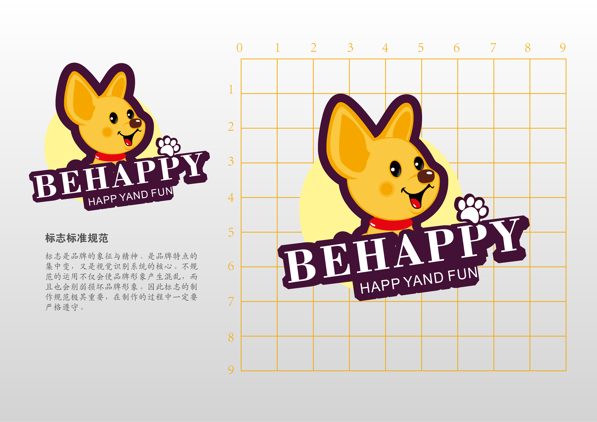
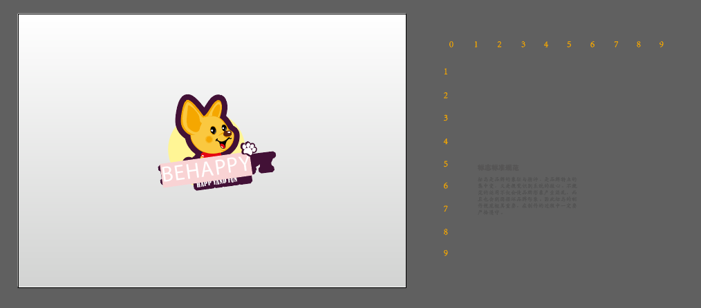
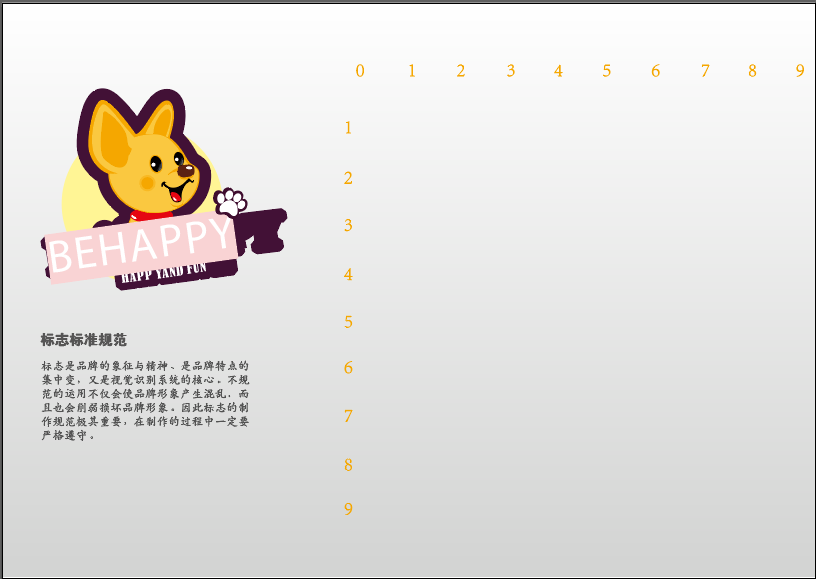
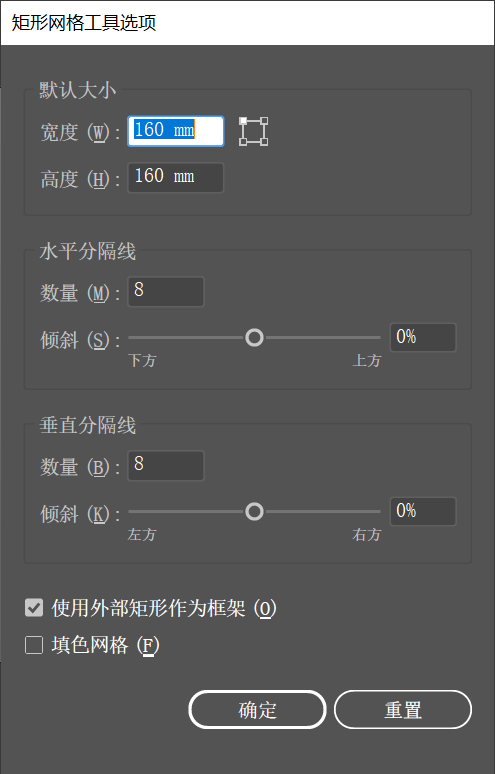
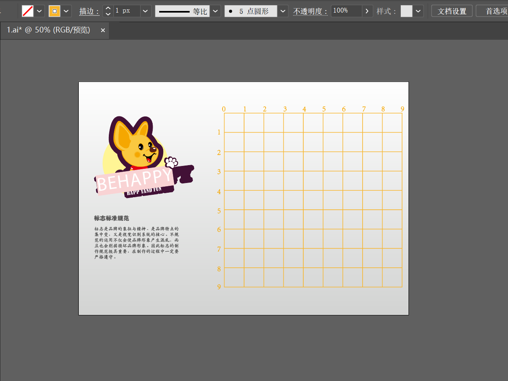
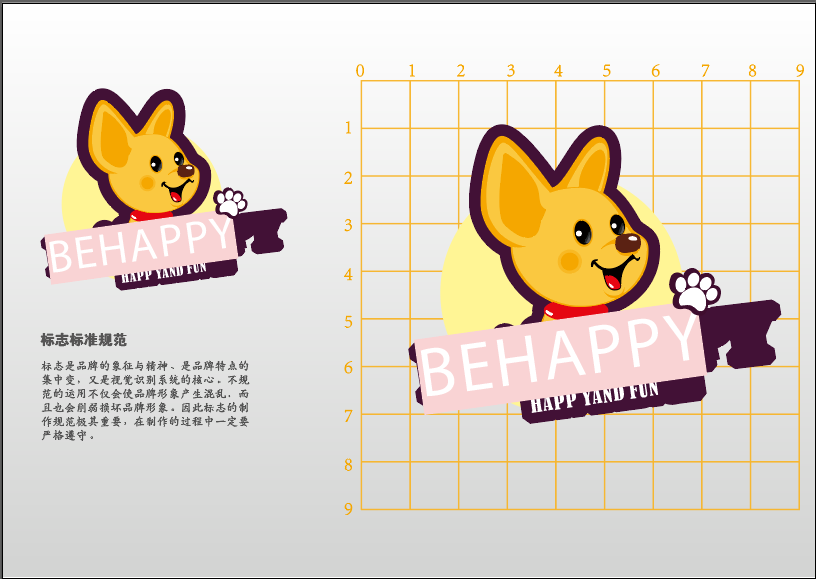

> 提示：资源文件路径：百度网盘 -> 《中文版Illustrator 2022完全案例教程》- 资源包 -> 2.配套素材 -> 2. 绘制简单的图形 -> 绘制网格制作企业vi 标志尺寸 -> 素材

`矩形网格工具`  位于线条工具组中，`矩形网格工具` 可以用来制作表格或网格状的背景。

**案例效果：**

**操作步骤：**

**步骤 01** 打开 `文件` -> `打开` 命令，将素材 `1.ai` 打开，如下图所示：

**步骤 02** 将画板外的内容移至画面中，并确定其在画面中的位置。如下图所示：

**步骤 03** 在画面中制作网格。选择工具箱中的 `矩形网格工具`，在控制栏中设置 `填充` 为 `无`，`描边` 为 `橘色`，`粗细` 为 `1pt`。然后在画面中单击，在弹出的 `矩形网格工具选项` 窗口中设置 `宽度` `高度` 数值均为 `160mm`，设置 `水平分隔线` `垂直分隔线` 的 `数量` 均为 8，`倾斜` 均为 0%。

**步骤 04** 设置完成后单击 `确定` 按钮。

**步骤 05** 由于本案例是要将标志规范地在网格中呈现出来，所以需要将标志复制一份放到右侧的网络中。选择标志，使用快捷键 <kbd>Ctrl</kbd>+<kbd>C</kbd> 将其复制一份，然后使用快捷 <kbd>Ctrl</kbd>+<kbd>V</kbd> 进行粘贴。接着将标志移到网格上方，将标志适当地放大。效果如下图所示：

