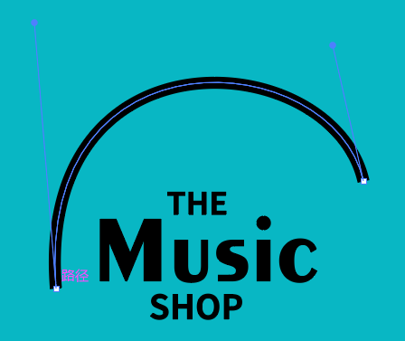
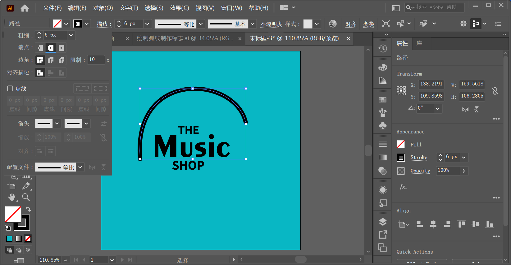

`弧形工具`  位于线条工具组中，使用该工具可以绘制任意弧度的弧线，也可以绘制特定尺寸与弧度的弧线。`弧形工具` 常用于绘制彩虹、雨伞、波浪线、抛物线或其他包含弧形线条的图形。下面以绘制如下图形为案例：

**步骤 01**

创建一个 `300x300` 的画板，绘制一个与画板相同大小的矩形作为背景，使用 `08B7C4` 颜色填充矩形。

**步骤 02**

从案例效果中可以看出，标志外围由弧线构成，所以首先需要绘制弧线。选择工具箱中的 `弧形工具`，在控制栏中设置 `填充` 为无，`描边` 为黑色，`粗细` 为 13pt。设置完成后在画面中按住鼠标左键绘制一段弧线。

**步骤 03**

此时，绘制的弧线与案例效果相差较大，需要进行调整。选择工具箱中的 `直接选择工具`，选中弧线的锚点，此时锚点附近出现控制柄，通过拖动控制柄的位置可以调整弧线的弧度。

**步骤 04**

案例效果中弧线的端点是圆头，而绘制出的弧线的端点是平头，所以需要对其端头样式进行更改。选择工具箱中的 `选择工具`，单击控制栏中的 `描边` 按钮，在弹出的面板中设置 `端点` 为 `圆头端点`。

**步骤 05**

为画面增加一些细节，让效果更加丰富。选择工具箱中的 `圆角矩形工具`，在控制栏中设置 `填充` 为黑色，`描边` 为无。设置完成后在画面中绘制图形。在该步骤中可以通过拖动圆角矩形上方的白色圆点调整圆角的大小。

**步骤 06**

将另一组带弧度的文字移到此处。

