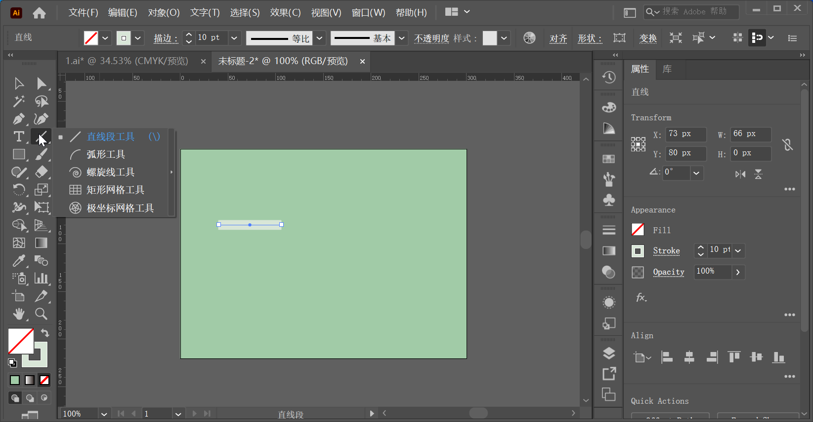
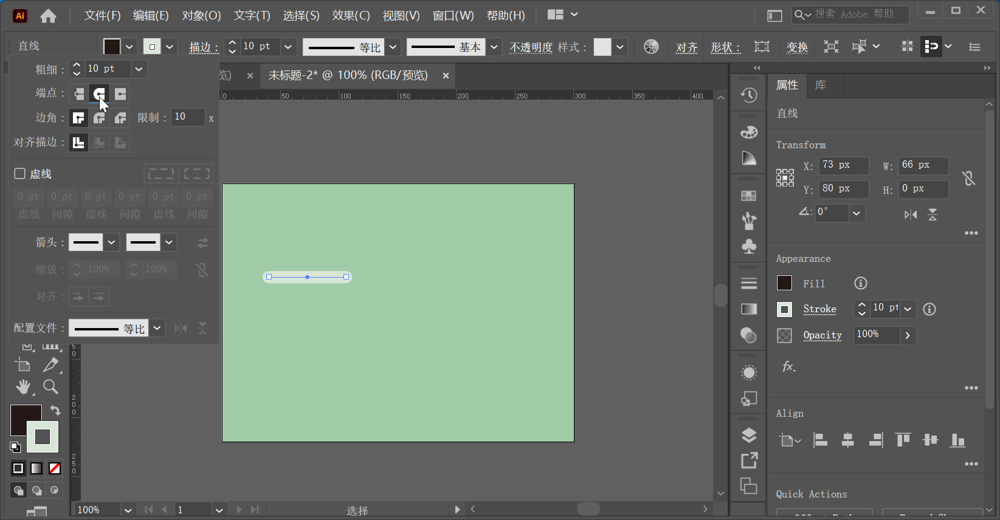
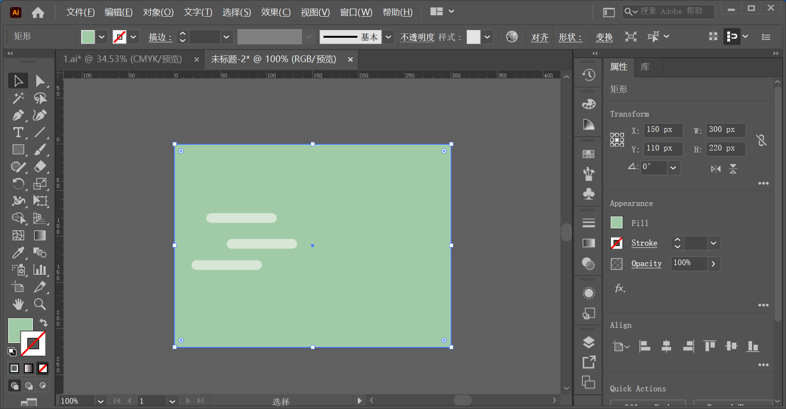
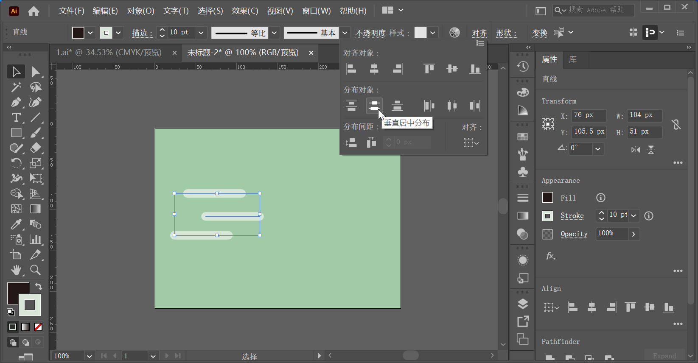
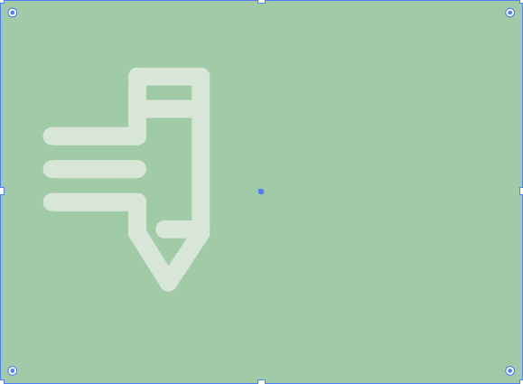

`直线段工具 `  可以轻松绘制出任意角度的线段，也可以配合快捷键准确地绘制水平线、垂直线以及斜 45° 的线条。配合描边宽度以及描边虚线的设置，`直线段工具` 常用于绘制分割线、连接线、虚线等线条对象。

下面是一个使用 `直线段工具` 的案例，操作步骤如下：

**步骤 01**

创建一个 `300x220` 的画板。

**步骤 02**

制作背景。选择工具箱中的 `矩形工具`，在控制栏中设置 `填充` 为浅绿色（`A1CBA7`），`描边` 为无。设置完成后在画面左上角按住鼠标左键拖动到右下角，绘制一个和画板等大的矩形。

**步骤 03**

使用 `直线段工具` 绘制标志。由于图形是由一条条直线组成，所以就需要绘制直线。选择工具箱中的 `直线段工具`，在控制栏中设置 `填充` 为无，`描边` 为浅灰色（`D8E6D7`），`粗细` 为 10pt。设置完成后在矩形上方按住 <kbd>Shift</kbd> 键的同时按住鼠标左键向右拖动绘制一条水平的直线。

**步骤 04**

此时，绘制的直线端点是平头的，效果不够圆润，需要对端点样式进行更改。在该直线选中的状态下，在控制栏中单击 `描边` 按钮，在弹出的面板中设置 `端点` 为 `圆头端点`。通过该操作可以将直线的端点更改为平头、圆头、方头三种样式。

**步骤 05**

由于该图形左侧的三条直线段时完全相同的，所以可以通过复制的方式得到另外两条。选择该直线段，使用快捷键 <kbd>Ctrl</kbd> + <kbd>C</kbd> 将其复制一份，使用快捷键 <kbd>Ctrl</kbd> + <kbd>V</kbd> 进行粘贴。将复制得到的图形放在已有直线下方位置。

**步骤 06**

然后使用同样的方法复制另外一条直线。

**步骤 07**

此时需要对三条直线的对齐方式进行调整。使用 `选择工具`，按住 <kbd>Shift</kbd> 键依次单击加选三条直线，在控制栏中单击 `左对齐` `垂直居中分布` 按钮，设置直线的对齐方式。

**步骤 08**

由于图形其他部分的绘制方式也是相同的，所以之后直线的绘制在这里将不再作详细的叙述。效果如下图。然后依次加选各条直线，使用快捷键 <kbd>Ctrl</kbd> + <kbd>G</kbd> 将其编组。

**步骤 09**

在该编组图形选中的状态下，在控制栏中设置 `不透明度` 为 70%。

**步骤 10**

使用 `选择工具` 将画板外的文字选中并移至标志右侧。适当地调整位置，此时该标志制作完成。效果如下。

