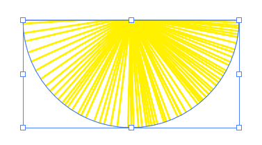

使用 `剪切蒙版` （快捷键 <kbd>Ctrl</kbd> + <kbd>7</kbd>）功能可以对图形剪切，操作方法如下：

**步骤 1**

选择 `直线段工具`  ，在控制栏中设置 `填充` 为无，`描边` 为黄色，`粗细` 为1pt。设置完成后在画板中绘制一条直线，保持鼠标不放，然后按住 <kbd>~</kbd> 键，拖动鼠标。随着拖动可以得到大量的直线，使其呈现出扇形外观。然后使用快捷键 <kbd>Ctrl</kbd> + <kbd>G</kbd> 将所有直线进行编组。

**步骤 2**

此时，可以看到绘制的直线长短不齐，需要将其进行整齐处理。选择工具箱中的 `椭圆工具`，在画板中按住 <kbd>Shift</kbd> 键的同时按住鼠标左键拖动绘制一个正圆。

**步骤 3**

将正圆更改为半圆。选择该正圆，将不按包放在定界框右侧的圆形控制点上，此时光标变为  形状。

**步骤 4**

按住鼠标左键拖动，让正圆的上半部分消失，呈现出半圆效果。

**步骤 5**

将该半圆放在直线编组图形上方，然后按住 <kbd>Shift</kbd> 键依次单击加选两个图形，右击执行 `建立剪切蒙版` 命令（快捷键为 <kbd>Ctrl</kbd> + <kbd>7</kbd>），将直线多余的部分隐藏。

