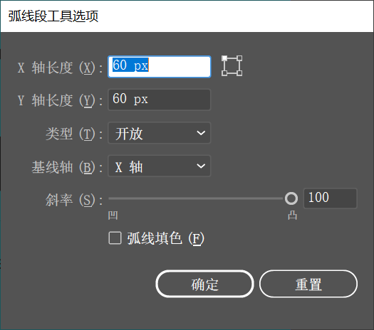

想要绘制精确斜率的弧线，可以单击工具箱中的 `弧形工具`  按钮，然后在需要绘制图形的地方单击，弹出 `弧线段工具选项` 窗口。在该窗口中可以对弧形的 `X/Y` 轴长度以及斜率进行相应设置，单击 `确定` 按钮完成设置。即可得到尺寸精确的图形。

+ **X 轴长度：**在文本框输入的数值，可以定义另一个端点在 X 轴方向的距离。
+ **Y 轴长度：**在文本框输入的数值，可以定义另一个端点在 Y 轴方向的距离。
+ **定位：**在 `X 轴长度` 选项右侧的定位器中单击不同的按钮，可以定义在弧线中首先设置端点的位置。
+ **类型：**表示弧线的类型，可以定义绘制的弧线对象是 `开放` 还是 `闭合`，默认情况下为 `开放`。
+ **基线轴：**可以定义绘制的弧线对象基线轴为 X 轴还是为 Y 轴。
+ **斜率：**通过调整选项中的参数，可以定义绘制弧线对象的弧度，绝对值越大弧度越大，正值凸起负值凹陷。
+ **弧线填色：**当勾选该复选框时，将使用当前的填充颜色填充绘制的弧线。