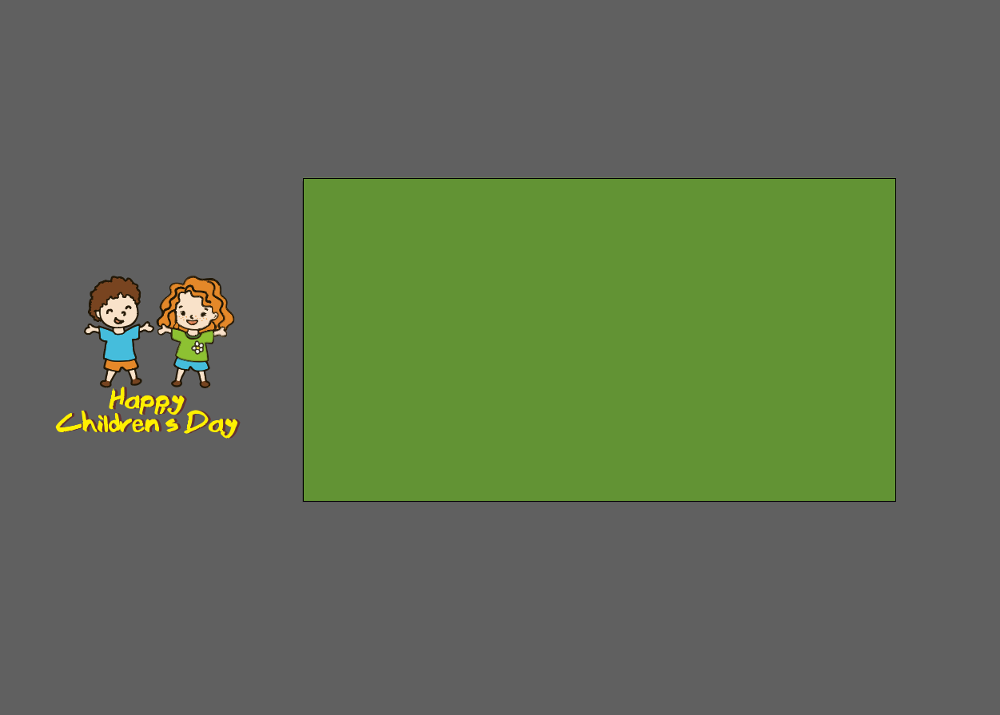
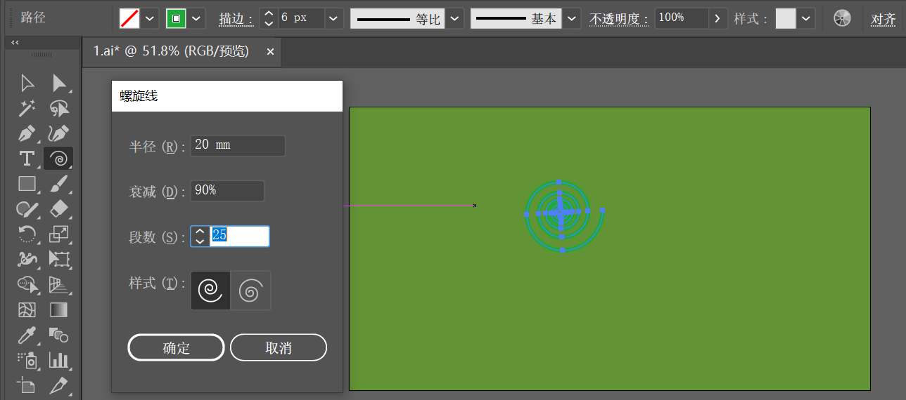
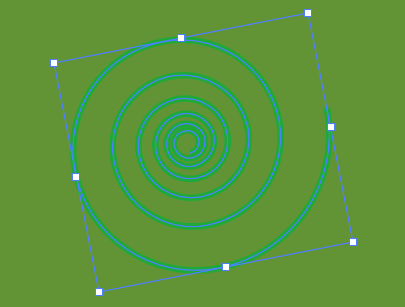
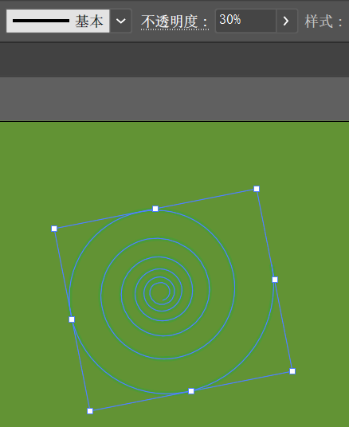
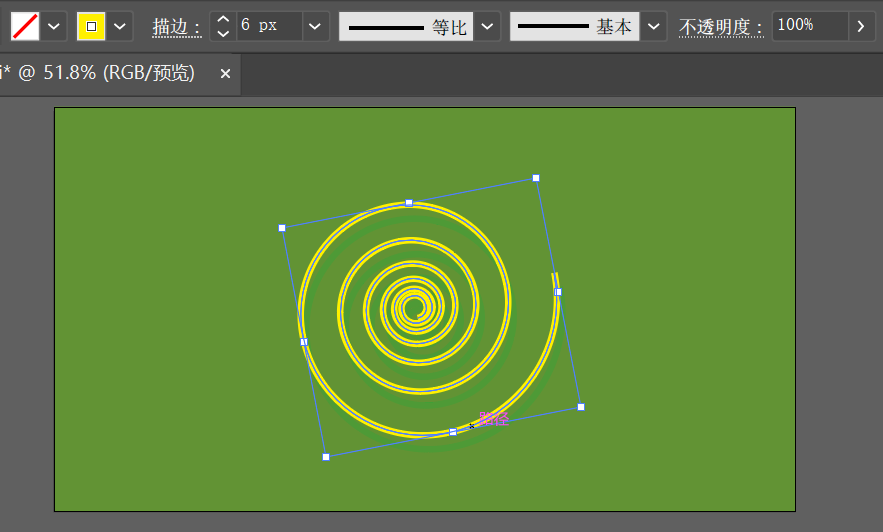

[toc]

> 提示：素材下载地址：百度网盘 -> 书籍资源 -> 《中文版Illustrator 2022完全案例教程》- 资源包 -> 2.配套素材 -> 2. 绘制简单的图形 -> 绘制螺旋线绘制儿童插画背景

"螺旋线工具"  位于线条工具组中，使用 “螺旋线工具” 可以绘制出半径不同、段数不同、样式不同的螺旋线。

### 1. 案例效果

### 2. 操作步骤

**步骤 01** 执行 `文件` -> `打开` 命令，将素材 `1.ai` 打开，如下图所示：

**步骤 02** 选择工具箱中的 “螺旋线工具”，在控制栏中设置 “填充” 为无，“描边” 为绿色，“粗细” 为 6pt。设置完成后在画面中单击，接着在弹出的 “螺旋线” 窗口中设置 “半径” 为 20mm，“衰减” 为 90%，“段数” 为 25，“样式” 为顺时针旋转。设置完成后单击 “确定” 按钮。

> 提示：
>
> 按住鼠标拖动时按住空格键，直线可以随鼠标的拖动位置移动。
>
> 按住鼠标拖动时按住 <kbd>Shift</kbd> 键锁定螺旋线的角度为 45° 的倍值，按住 <kbd>Ctrl</kbd> 键可以保持涡形的衰减比例。
>
> 按住鼠标拖动时按向上或向下的箭头键，可以增加或减少涡形路径片段的数量。

**步骤 03** 选择该图形，将光标放在定界框一角并按住鼠标左键将其进行旋转，如下图所示：

**步骤 04** 旋转螺旋线，在控制栏中设置 “不透明度” 为 30%。效果如下图所示：

**步骤 05** 选择该图形，使用快捷键 <kbd>Ctrl</kbd> + <kbd>C</kbd> 将其复制一份，使用快捷键 <kbd>Ctrl</kbd> + <kbd>F</kbd> 将复制得到的图形，在控制栏中设置 “填充” 为无，“描边” 为黄色，“粗细” 为 6pt，“不透明度” 为 100%，将该图形向上移动。效果如下图所示：

**步骤 06** 将画板外的任务和文字移至画面中，并调整位置，此时本案例制作完成。

