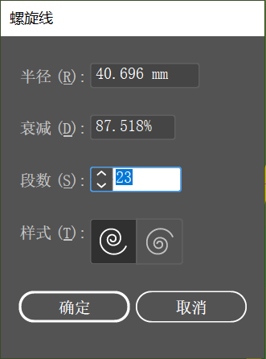

想要绘制特定参数的螺旋线，可以单击工具箱中的 “螺旋线工具”  按钮，在需要绘制螺旋线的位置单击，会弹出 “螺旋线” 窗口。在该窗口中进行相应设置，单击 “确定” 按钮完成参数的设置，即可得到精确尺寸的图形。如下图所示：

+ 半径：在选项的文本框中输入相应的数值，可以定义螺旋线的半径尺寸。
+ 衰减：用来控制螺旋线之间相差的比例，百分比越小，螺旋线之间的差距就越小。
+ 段数：通过调整选项中的参数，可以定义螺旋线对象的段数，数值越大螺旋线越长，数值越小螺旋线越短。
+ 样式：可以选择顺时针或逆时针定义螺旋线的方向。