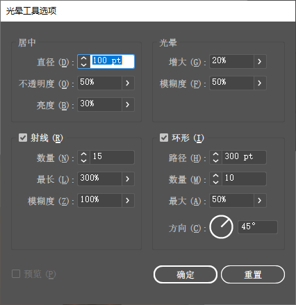

1. 正圆形：按 <kbd>Shift</kbd>键； 从中心绘制：按<kbd>Alt</kbd>键。

2. 圆角矩形：绘制时，按上下方向键改变圆角的半径；按左右方向键，在最大和最小圆角之间切换。

3. 多边形：绘制时，按上下方向键，可以改变边数。

4. 星形：按住<kbd>ctrl</kbd>键拖曳，可以改变星形的尖锐度，往外拖越尖锐，往内拖越不尖锐；按<kbd>Alt</kbd>键，临时切换到正常的星形。

5. 光晕工具：双击光晕工具图标可以打开光晕工具选项窗口。

   

