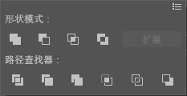

**形状模式特点：**

按 <kbd>Alt</kbd> 键点击运算按钮，可以编辑路径，可以点击扩展；直接点击按钮，运算的对象直接变为一体的，不能修改原形状。

**路径查找器模式的特点：**

1. 图像使用完路径查找器后，所有的对象默认都是编组状态；
2. 如果想单独移动修改某个对象，需要取消编组 <kbd>Ctrl</kbd>+<kbd>Shift</kbd>+<kbd>G</kbd> 编组选择工具；在组中选择单个对象，进行修改或解除编组。