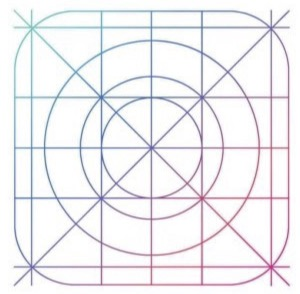
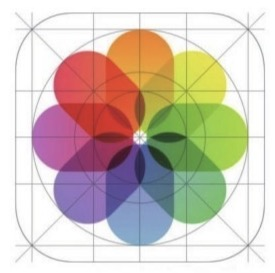
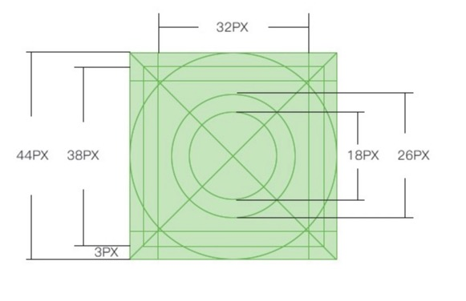
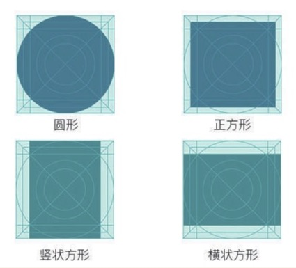

1. 高辨识度

用户对图形的识别敏锐度要远强于对文字的识别敏锐度。

2. 独特的形状

最好的应用程序图标都是独一无二的，足够整洁，足够有魅力，足够令人难忘。

3. 使用网格系统

苹果公司开发出了一套黄金分割的网格系统。苹果多数图标按照网格系统进行规范设计，这也为设计师们提供了设计的方向。

如果只是单个图标的话，大小可以随意设置。而多个图标最好遵循大小统一的黄金比例原则。

44px X 44px 的图标

不同形状图形的黄金分割

4. 简化文字

在进行图标设计的时候，因为文字字形的多样性会使设计受到很大的限制，所以不建议使用文字。必须要使用文字进行图标设计时，尽量使用字母来代替文字以利于传播。

> 提示
> 当 App 有很强的定位时，可以选择在图标中加入品牌意识。即可以直接将公司的 Logo 运用在图标设计中，当然前提是公司的 Logo 已经足够深入人心，或有足够的设计感。
