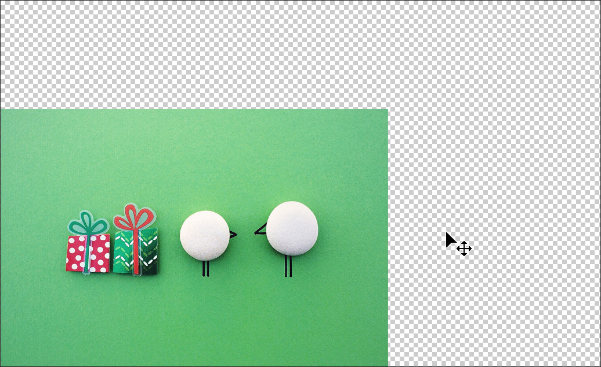
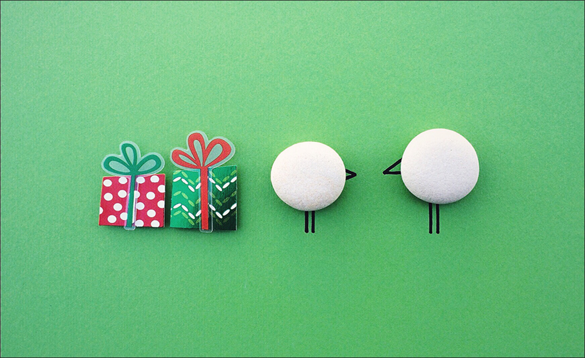

> 提示：资源路径：百度网盘 -> 书籍资源 -> Photoshop 2021 从入门到实战 -> 实例文件素材 -> 1.实例文件与素材 -> 上 -> 2.图层的基础操作 -> 2.3.2 内容识别缩放：拉伸不变形 -> 内容识别缩放：拉伸不变形.psd

在变换图像时经常要考虑是否等比的问题，因为很多不等比的变形是不美观、不专业、不能用的。但是对于一些图形，等比缩放确实能够保证画面效果不变形，但是图像尺寸可能就不符合要求了。那有没有一种方法既能保证画面效果不变形，又能不等比地调整大小呢？答案是有的，可以使用 `内容识别缩放` 命令进行缩放操作。

（1）选择需要变形的普通图层，如下图所示，如果需要将这个图片素材用在 A4 大小的画布中，图像比例明显不合适。尝试使用自由变换组合键 <kbd>Ctrl</kbd> + <kbd>T</kbd> 调出定界框，按住 <kbd>Shift</kbd> 键拖动控制点进行不等比的变形将画面填充满，那么图片就会变形。

    

（2）若执行 `编辑` -> `内容识别缩放` 命令调出定界框，然后按住 <kbd>Shift</kbd> 键拖动控制点进行不等比的变形，填满整个画布。此时可以发现画面主体图案没有变形，而背景部分被放大，填充了整个画面。

（3）如果要缩放人像图片，可以在执行完 `内容识别缩放` 命令之后，单击工具选项栏中的 `保护肤色` 按钮 ，然后进行缩放。这样可以最大限度地保证人物比例不发生明显的变形。

> 提示：选项栏中 `保护` 选项的用法
>
> 选择要保护的区域的 `Alpha` 通道。如果要在缩放图像时保留特定的区域，`内容识别缩放` 命令允许在调整大小的过程中使用 `Alpha` 通道来保护内容。