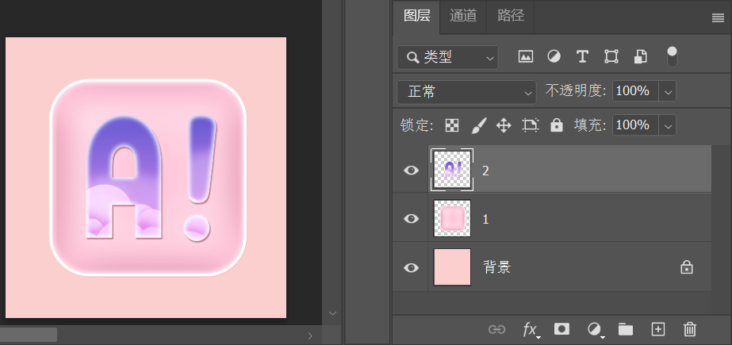
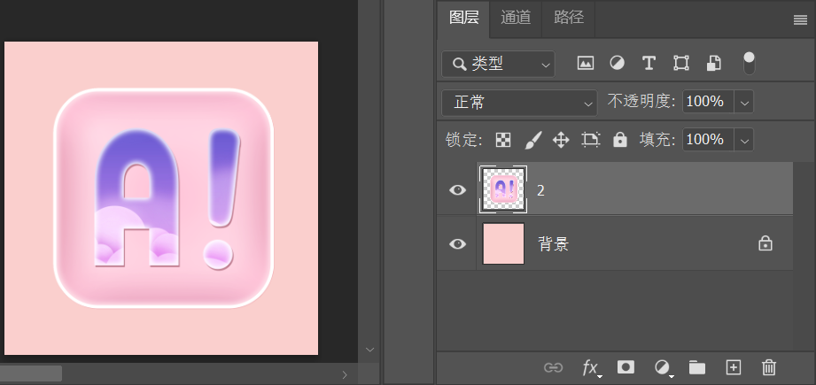

[toc]

> 资源位置：百度网盘 -> 书籍资料 -> Photoshop 2021 从入门到实战 -> 实例文件素材 -> 1.实例文件与素材 -> 上 -> 2.图层的基础操作 ->2.2.4 合并图层 -> 素材

合并图层是指将所有选中的图层合并成一个图层。例如，多个图层合并前如下图：

将 `背景` 图层以外的图层进行合并后如下图：

### 1. 合并图层

想要将多个图层合并为一个图层，可以在 `图层` 面板中选中某一图层，然后按住 <kbd>Ctrl</kbd> 键加选需要合并的图层，执行 `图层` -> `合并图层` 命令或按组合键 <kbd>Ctrl</kbd> + <kbd>E</kbd>。

### 2. 合并可见图层

执行 `图层` -> `合并可见图层` 命令或按组合键 <kbd>Ctrl</kbd> + <kbd>Shift</kbd> + <kbd>E</kbd> 可以将合并 `图层` 面板中的所有可见图层变成背景图层。

### 3. 拼合图像

执行 `图层` -> `拼合图像` 命令，即可将全部图层合并到 `背景` 图层中。如果有隐藏的图层，则会弹出一个提示对话框，询问用户是否扔掉隐藏的图层。

### 4. 盖印

盖印可以将多个图层的内容合并到一个新的图层中，同时保持其他图层不变。选中多个图层，然后按组合键 <kbd>Ctrl</kbd> + <kbd>Alt</kbd> + <kbd>E</kbd>，可以将这些图层中的图像盖印到一个新的图层中，而原始图层的内容保持不变。按组合键 <kbd>Ctrl</kbd> + <kbd>Shift</kbd> + <kbd>E</kbd> ，可以将所有可见图层盖印到一个新的图层中。