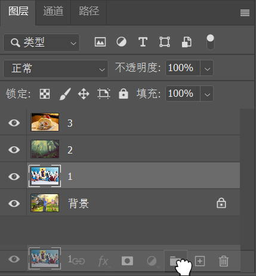

[toc]

> 资源位置：百度网盘 -> 书籍资料 -> Photoshop 2021 从入门到实战 -> 实例文件素材 -> 1.实例文件与素材 -> 上 -> 2.图层的基础操作 ->2.2.3 图层编组 -> 素材

图层组就像一个 `文件袋` 。在办公时如果有很多文件，我们将同类文件放在一个文件袋中，并在文件袋上表明信息。而在 `Photoshop` 中制作复杂的图像效果时也是一样的，`图层` 面板中经常会出现数十个图层，把它们分门别类地 `收纳` 起来是一个非常好的习惯，在后期操作中可以更加便捷地对画面进行处理。

### 1. 创建图层组

单击 `图层` 面板底部的 `创建新组` 按钮 ，即可创建一个新的图层组。也可以选择需要放置在组中的图层，按住鼠标左键拖曳至 `创建新组` 按钮上，则以所选图层创建图层组。

> 提示：尝试创建一个 "组中组"
>
> 图层组中还可以嵌套其他图层组。将创建好的图层组移到其他组中即可创建出“组中组
> ”。

### 2. 将图层移入或移出图层组

（1）选择一个或多个图层，按住鼠标左键拖曳到图层组内，松开鼠标就可以将其移入该组中。

（2）将图层组中的图层拖曳到组外，就可以将其从图层组中移出。

### 3. 取消图层编组

在图层组名称上右击，在弹出的快捷菜单中选择 `取消图层编组` 命令。图层组消失，而组中的图层并未被删除。