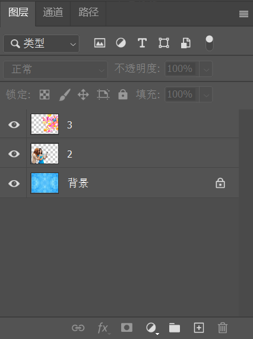
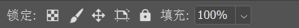
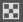
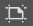
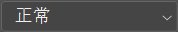
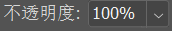
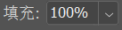

图层中各选项介绍如下：

+ **图层过滤 ：**用于筛选特定类型的图层或查找某个图层。在左侧的下拉列表框中可以选择筛选方式，在其列表右侧可以选择特殊的筛选条件。单击最右侧的  按钮，可以启用或关闭 `图层过滤` 功能。

+ **锁定 ：**选中图层，单击 `锁定透明像素`  按钮，可以将编辑范围限制为只针对图层的不透明部分；单击 `锁定图像像素`  按钮，可以防止使用绘画工具修改图层的像素；单击 `锁定位置`  按钮，可以防止图层的像素被移动；单击  按钮，可以防止在画板内外自动嵌套；单击 `锁定全部`  按钮，可以锁定透明像素、图像像素和位置，处于这种状态下的图层将不能进行任何操作。

  > 提示：为什么锁定状态有空心的和实心的
  >
  > 当选择图层后单击 `锁定全部` 按钮后，图层名称的右侧会出现一个实心的所；背景图层则显示空心的所。

+ **混合模式 ：** 用来设置当前图层的混合模式，使之与下面的图像产生混合。在该下拉列表框中提供了很多种混合模式，选择不同的混合模式，产生的图层混合效果不同。

+ **不透明度 ：**用来设置当前图层（包含图层样式部分）的不透明度。

+ **填充 ：**用来设置当前图层的填充不透明度。该选项与 `不透明度` 选项类似，但是不会影响图层样式效果。

+ **切换图层显隐 ：**当该图标显示为  时表示当前图层处于可见状态，而显示为  时则处于不可见状态。单击该图标，可以在显示与隐藏之间进行切换。

+ **链接图层  ：**选择多个图层后，单击该按钮，所选的图层会被链接在一起。被链接的图层可以在选中其中某一图层的情况下进行共同移动或变换等操作。当链接好多个图层后，图层名称的右侧就会显示链接标志。

+ **添加图层样式  ：**单击该按钮，在弹出的快捷菜单中选择一种样式，可以为当前图层添加该样式。

+ **创建新的填充或调整图层  ：**单击该按钮，在弹出的快捷菜单中选择相应的命令，即可创建填充图层或调整图层。此按钮主要用于创建调色调整图层。

+ **创建新组** ：单击该按钮，即可创建出一个图层组。

+ **创建新图层** ： 单击该按钮，即可在当前图层的上层新建一个图层。

+ **删除图层** ： 选中图层后，单击该按钮，可以删除图层。

  