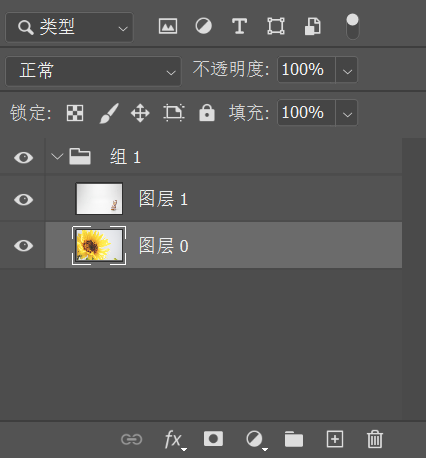
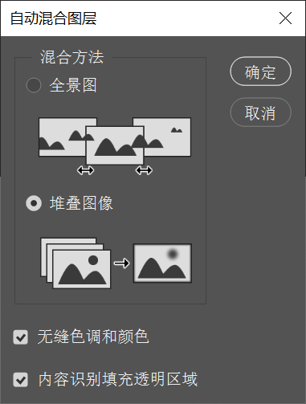
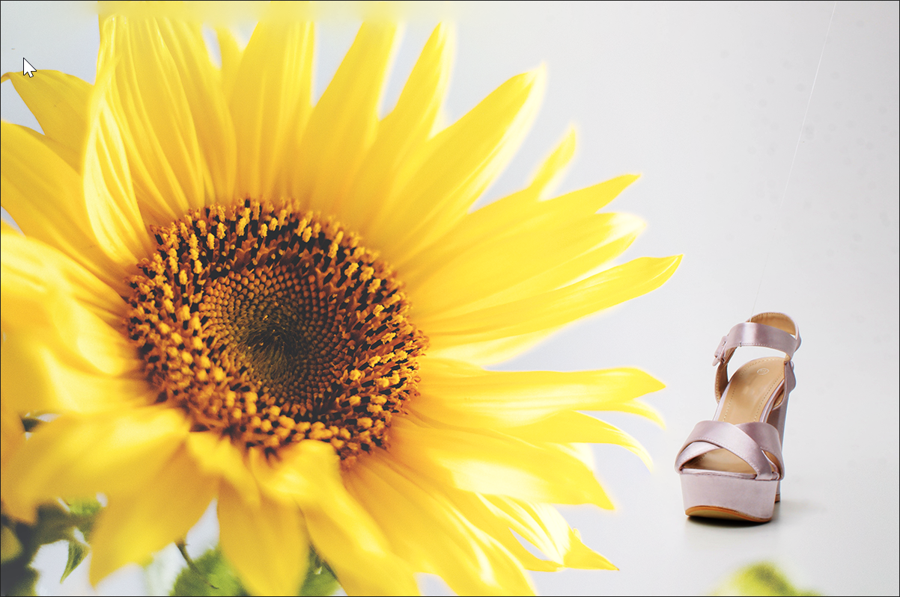

> 提示：资源路径：百度网盘 -> 书籍资源 -> Photoshop 2021 从入门到实战 -> 实例文件素材 -> 1.实例文件与素材 -> 上 -> 2.图层的基础操作 -> 2.3.6 多个图层自动混合 -> 多个图层自动混合 .psd

`自动混合图层` 功能可以自动识别画面内容，并根据需要对图层应用图层蒙版，以遮盖过渡曝光、曝光不足的区域或内容差异。使用 `自动混合图层` 命令可以缝合或者组合图像，从而在最终图像中获得平滑的过渡效果。

（1）打开一张图片，接着置入一张素材，并将置入的图层栅格化。

（2）按住 <kbd>Ctrl</kbd> 键加选两个图层，然后执行 `编辑` -> `自动混合图层` 命令，在弹出的 `自动混合图层` 窗口中选中 `堆叠图像`，单击 `确定` 按钮。

    