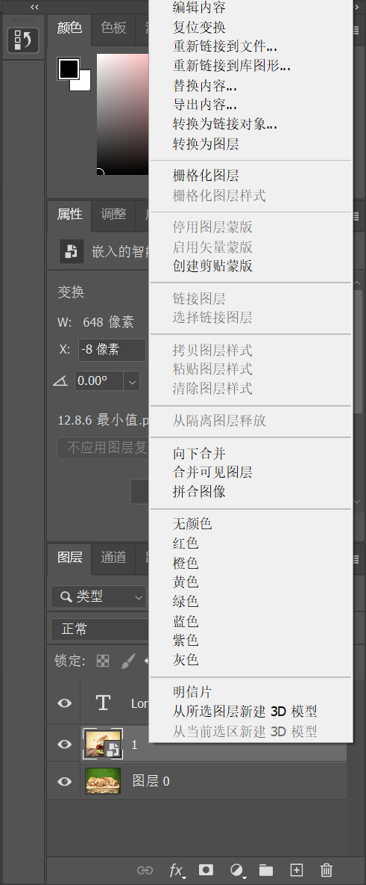

> 资源位置：百度网盘 -> 书籍资料 -> Photoshop 2021 从入门到实战 -> 实例文件素材 -> 1.实例文件与素材 -> 上 -> 2.图层的基础操作 -> 2.1.7 将特殊图层变为普通图层 -> 素材

Photoshop 中有几种特殊图层，如文字图层、智能对象图层、矢量形状图层、3D 图层等。这些图层虽然可以移动、变换，但是不能对图层本身内容进行编辑。想要编辑这些特殊对象的内容，就需要将它们转换为普通图层。

“栅格化” 图层就是将特殊图层转换为普通图层的过程。选择需要栅格化的图层，然后执行 `图层` -> `栅格化` 子菜单中的相应命令，或者在 `图层` 面板中选中该图层，右击，在弹出的快捷菜单中选择 `栅格化图层` 命令。随即可以看到 `特殊图层` 已转换为 `普通图层`。

