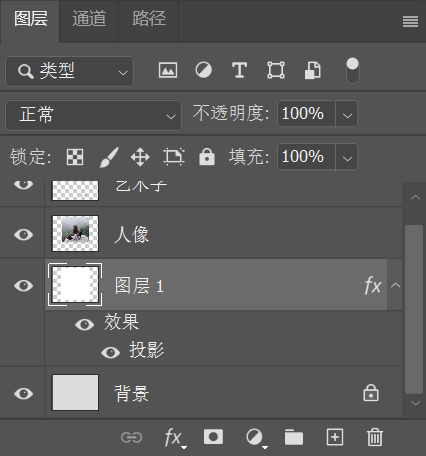

若要向图像中添加一些绘制的元素，最好创建新的图层，这样可以避免绘制失误而对原图产生影响。

在 “图层” 面板底部单击 “创建新图层”  按钮，即可在当前图层的上一层新建一个图层。单击即可选中该图层，然后在其中进行绘图操作。

当文档中的图层比较多时，可能很难分辨某个图层。为了便于管理，可以对已有的图层进行命名。将关闭移至图层名称处并双击，图层名称便处于激活状态，然后输入新的名称，按 <kbd>Enter</kbd> 键确定。

