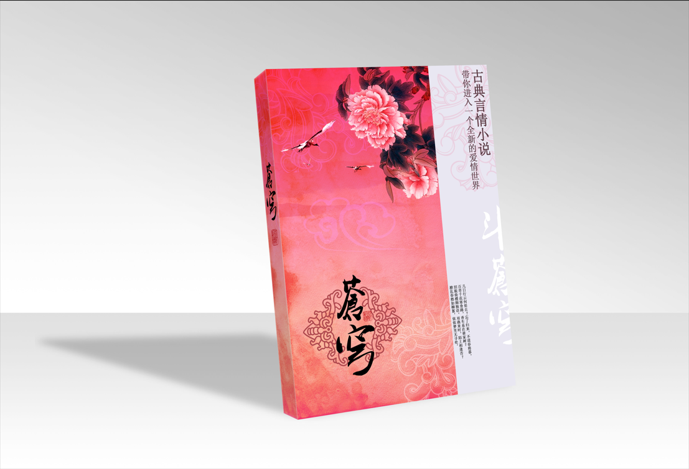
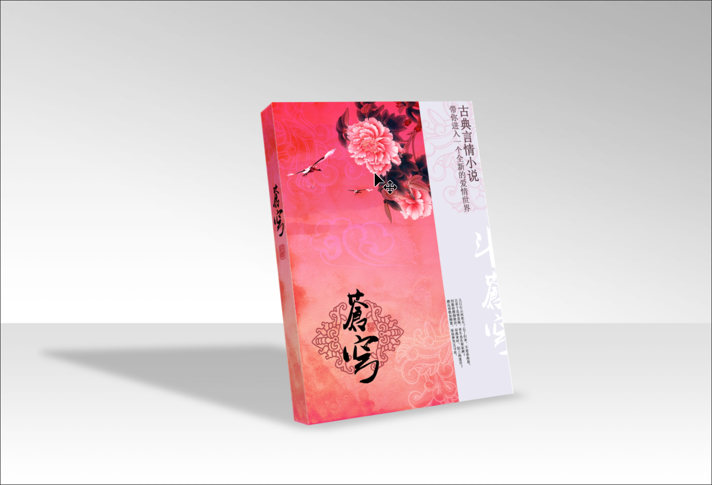

> 提示：资源路径：百度网盘 -> 书籍资源 -> Photoshop 2021 从入门到实战 -> 实例文件素材 -> 1.实例文件与素材 -> 上 -> 2.图层的基础操作 -> 2.4 综合实例：变换图层制作立体书籍 -> 变换图层制作立体书籍.psd

**案例效果**

案例效果如下所示：

**操作步骤**

**步骤 01** 本案例通过将素材放在不同的图层，再结合 `自由变换` 操作制作出立体书籍的展示效果。执行 `文件` -> `打开` 命令，将背景素材 `1.jpg` 打开。

**步骤 02** 执行 `文件` -> `置入嵌入对象` 命令，在弹出的 `置入嵌入的对象` 窗口中选择素材 `2.jpg`，然后单击 `置入` 按钮将素材置入。接着将光标放在定界框外的控制点上方按住鼠标左键将素材进行等比例缩小，并将素材移动至背景图片中的立体倒影位置。操作完成后按 <kbd>Enter</kbd> 键完成操作。

**步骤 03** 选择置入的素材图层，右击，在弹出的快捷菜单中执行 `栅格化图层` 命令，将素材图层进行栅格化处理。

**步骤 04** 制作立体的书籍封面。选择素材图层，使用自由变换组合键 <kbd>Ctrl</kbd> + <kbd>T</kbd> 调出定界框，将光标放在定界框任意一角将素材进行旋转。

**步骤 05** 在当前自由变换状态下，右击，在弹出的快捷菜单中执行 `扭曲` 命令，调整四角控制点的位置（也可以直接在自由变换状态下，按住 <kbd>Shift</kbd> 键与 <kbd>Ctrl</kbd> 键，将光标移动到控制点上进行拖动调整）。按 <kbd>Enter</kbd> 键完成操作，此时立体的书籍封面制作完成。

**步骤 06** 制作立体的书脊。置入书脊素材 `3.jpg`，调整大小放在封面左边位置并将图层栅格化。然后用同样的方式对书脊进行自由变换操作，制作出立体的书脊。此时立体书籍的展示效果制作完成。

