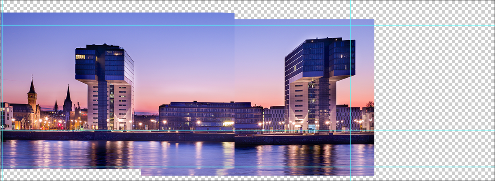
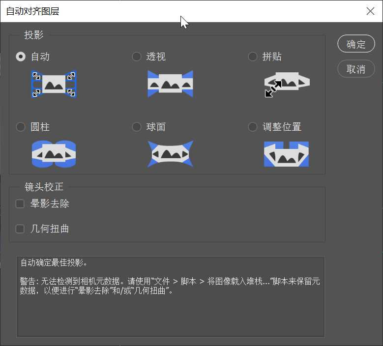

> 提示：资源路径：百度网盘 -> 书籍资源 -> Photoshop 2021 从入门到实战 -> 实例文件素材 -> 1.实例文件与素材 -> 上 -> 2.图层的基础操作 -> 2.3.5 自动对齐图层拼接长图 -> 自动对齐图层拼接长图.psd

爱好摄影的朋友们可能会遇到这样的情况：在拍摄全景图时，由于拍摄条件的限制，可能要拍摄多张照片，然后通过后期进行拼接。使用 `自动对齐图层` 命令可以快速将单张图片组合成一张全景图。

（1）新建一个空白文档，然后置入素材。接着将置入的图层栅格化。适当调整图像的位置。图像与图像之间必须有重合的区域。

（2）按住 <kbd>Ctrl</kbd> 键单击加选图层，执行 `编辑` -> `自动对齐图层` 命令，打开 `自动对齐图层` 窗口。选择 `自动` 选项，单击 `确定` 按钮。得到的画面效果如下图所示。在自动对齐之后，可能会出现透明像素，可以使用 `裁剪工具` 进行裁剪。

    