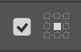
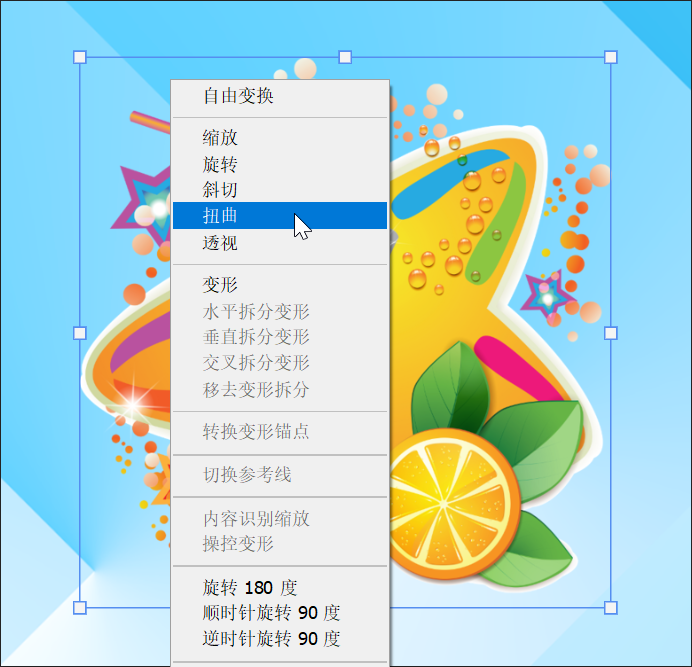
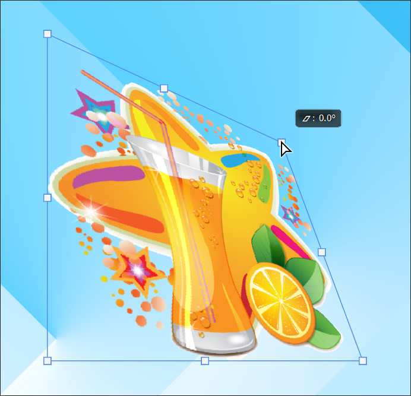
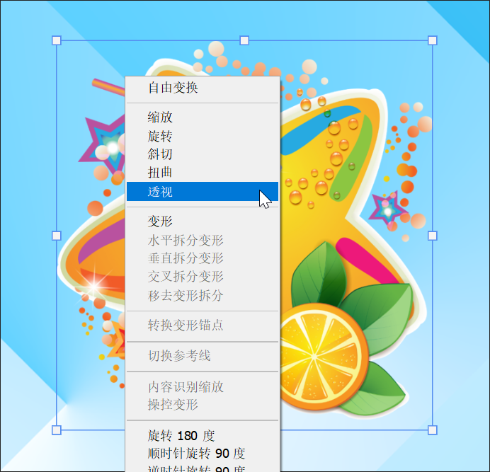
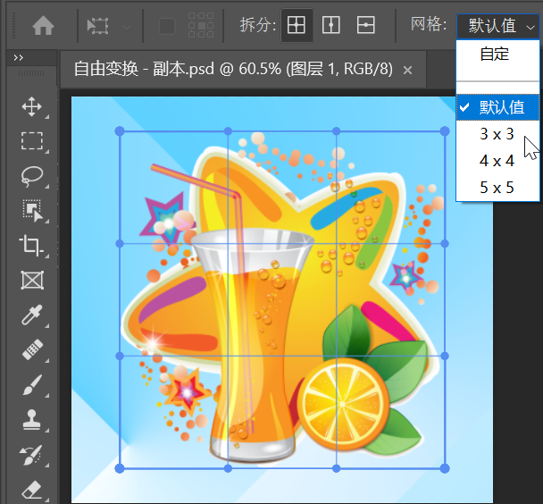
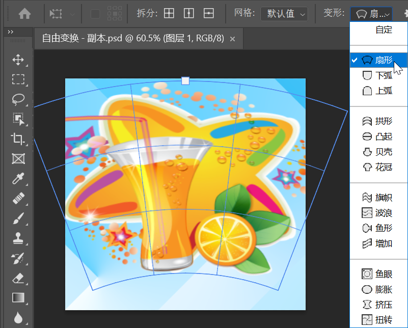
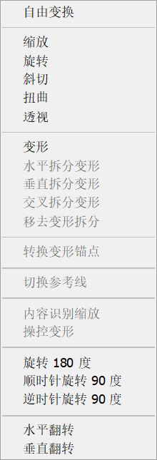

> 提示：资源路径：百度网盘 -> 书籍资源 -> Photoshop 2021 从入门到实战 -> 实例文件素材 -> 1.实例文件与素材 -> 上 -> 2.图层的基础操作 -> 2.3.1 自由变换 -> 自由变换.psd

> 提示："背景" 图层无法进行变换
>
> 打开一张图片后，有时会发现无法使用 `自由变换` 命令，这可能是因为打开的图片只包含一个 `背景` 图层。此时需要将 `背景` 图层转换为普通图层，然后就可以使用 `编辑` -> `自由变换` 命令了。

**动手练：自由变换**

在制图过程中，经常需要调整普通图层的大小、角度，有时也需要对图层的形态进行扭曲、变形，这些都可以通过 `自由变换` 命令来实现。选中需要变换的图层，执行 `编辑` -> `自由变换` 命令（组合键为 <kbd>Ctrl</kbd> + <kbd>T</kbd>）。此时对象进入自由变换状态，四周出现了定界框，4 个角点处以及 4 条边框的中间都有控制点。完成变换后，按 <kbd>Enter</kbd> 键确认。如果要取消正在进行的变化操作，可以按 <kbd>Esc</kbd> 键。

**1. 调整中心点位置**

默认情况下中心点位于定界框的中心位置，在旋转过程中旋转的 `轴` 就是这个中心点。如果要更改中心点的位置，可以在自由变换状态下，勾选选项栏中的 `参考点位置` 复选框 ，在右侧的小图标上以单击的方式选择中心点的位置。如果要移动中心点的位置，则将光标移动至中心点上按住鼠标左键拖动即可移动中心点的位置。还可以按住 <kbd>Alt</kbd> 键单击设置中心点的位置。

**2. 放大、缩小**

默认情况下选项栏中的 `保持长宽比`  处于激活状态，此时按住鼠标左键并拖曳定界框边框上的控制点，可以对图层进行等比例放大或缩小。若要非等比缩放，单击选项栏中的 `保持长宽比` 按钮取消激活状态，然后拖动控制点即可进行不等比的缩放。

如果按住 <kbd>Alt</kbd> 键的同时拖曳定界框 4 个角点处的控制点，能够以中心点作为缩放中心尽显缩放。

**3. 旋转**

将光标移动至控制点外侧，当其变为弧形的双箭头 形状后，按住鼠标左键拖动即可进行旋转。

**4. 斜切**

在自由变换状态下，右击，在弹出的快捷菜单中执行 `斜切` 命令，然后按住鼠标左键拖曳控制点，即可看到变换效果。

     

**5. 扭曲**

在自由变换状态下，右击，在弹出的快捷菜单中执行 `扭曲` 命令，可以在定界框边线处按住鼠标左键并拖动，也可以在控制点处按住鼠标左键并拖动。

    

**6. 透视**

在自由变换状态下，右击，在弹出的快捷菜单中执行 `透视` 命令，拖曳一个控制点即可产生透视效果。此外，也可以选择需要变换的图层，执行 `编辑` -> `变换` -> `透视` 命令。

    

**7. 变形**

在自由变换状态下，右击，在弹出的快捷菜单中执行 `变形` 命令，在选项栏中 `拆分` 中选择一种创建变形网格的方式，然后在定界框内单击可以创建变形网格点。在工具选项栏的 `网格` 下拉列表中选择预设的网格数量。变形网格创建完成后，拖动控制点即可进行变形。

    

在工具选项栏的 `变形` 下拉列表框中选择一个合适的形状。例如，选择 `扇形`。接着在选项栏中进行参数的设置，设置完成后按 <kbd>Enter</kbd> 键确定变换操作。

**8. 旋转 180 度，顺时针旋转 90 度、逆时针旋转 90 度、水平翻转、垂直翻转**

在自由变换状态下，右击，在弹出的快捷菜单的底部还有 5 个旋转的命令，即 `旋转 180 度`、`顺时针旋转 90 度`、`逆时针旋转 90 度`、`水平翻转`、`垂直翻转` 命令。顾名思义，根据这些命名的名字就能够判断出它们的用法。

**9. 复制并重复上一次变换**

如要制作一系列变换规律相似的元素，可以使用 `复制并重复上一次变换` 功能来完成。在使用该功能之前，需要线设定好一个变换规律。

复制一个图层，使用组合键 <kbd>Ctrl</kbd> + <kbd>T</kbd> 调出自由变换定界框，然后调整 `中心点` 的位置，接着进行旋转和缩放操作。接着按 <kbd>Enter</kbd> 键确定变换操作，然后多次按组合键 <kbd>Shift</kbd> + <kbd>Ctrl</kbd> + <kbd>Alt</kbd> + <kbd>T</kbd>，可以得到一系列按照上一次变换规律进行变换的图形。

