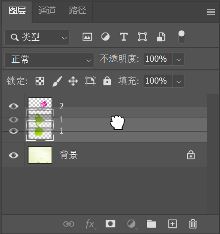

> 资源位置：百度网盘 -> 书籍资料 -> Photoshop 2021 从入门到实战 -> 实例文件素材 -> 1.实例文件与素材 -> 上 -> 2.图层的基础操作 -> 2.2.1 调整图层顺序 -> 素材

在 `图层` 面板中，位于上方的图层会遮挡住下方的图层。在制图过程中经常需要调整图层堆叠的顺序。

例如，默认情况下新置入的素材图层将位于刚刚选中图层的上方。在 `图层` 面板中选择该图层，按住鼠标左键向下拖曳。松开鼠标后，即可完成图层顺序的调整。

