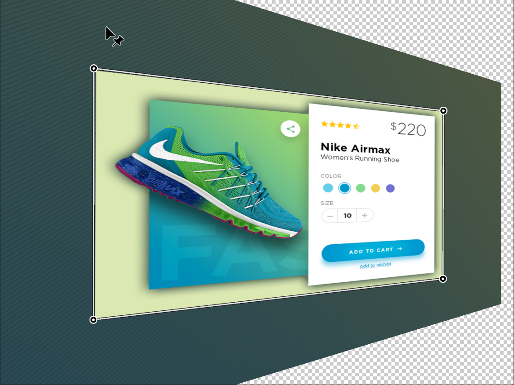

> 提示：资源路径：百度网盘 -> 书籍资源 -> Photoshop 2021 从入门到实战 -> 实例文件素材 -> 1.实例文件与素材 -> 上 -> 2.图层的基础操作 -> 2.3.4 透视变形 -> 透视变形.psd

`透视变形` 可以根据对图像现有的透视关系进行变形。

（1）打开一张图片。执行 `编辑` -> `透视变形` 命令，然后在画面中单击或者按住鼠标左键拖曳，绘制透视变形网格。绘制好透视变形网格后按下 <kbd>Enter</kbd> 键确定。

（2）根据透视关系拖曳控制点，调整控制框的形状。单击选项栏中的 `变形` 按钮，然后拖曳控制点进行变形。随着控制点的调整，画面中的透视也在发生着变换。变形完成后按 <kbd>Enter</kbd> 键确定。

