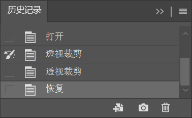

执行 “窗口 > 历史记录” 命令，打开 “历史记录” 面板。

当对文档进行一些编辑操作时，会发现 “历史记录” 面板中会出现刚刚进行的操作条目。单击其中某一项历史记录操作，就可以使文档返回之前的编辑状态。

“历史记录” 面板还有一项 “快照” 功能。这项功能可以为某个操作状态快速 “拍照”，将其作为一项 “快照”，留在 “历史记录” 面板中，以便于在很多操作步骤以后还能够返回到之前某个重要的状态。选择需要创建快照的状态，然后单击 “创建新快照” 按钮，即可出现一个新的快照。

若需删除快照，在 “历史记录” 面板中选择需要删除的快照，然后单击 “删除当前状态” 按钮或将快照拖曳到该按钮上，在弹出的窗口中单击 “是” 按钮即可。