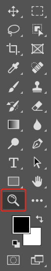

[toc]

### 方法一：

选择缩放工具，按鼠标左键不放左右摆动鼠标即可放大或缩小图像。

### 方法二：

直接在其他任何工具的情况下，按住 <kbd>Ctrl</kbd>+<kbd>+</kbd> 快捷键放大图像，按住 <kbd>Ctrl</kbd>+<kbd>-</kbd> 快捷键缩小图像。

### 方法三：

直接在其他任何工具的情况下，按住 <kbd>Alt</kbd> 键不放，向前滚动鼠标滚轮放大图像，向后滚动鼠标滚轮缩小图像。

### 方法四：

按住 <kbd>Ctrl</kbd>+<kbd>空格键</kbd> 放，这时鼠标变成放大图形，左右摆动鼠标可以放大或缩小图像。 

> 提示： <kbd>Ctrl</kbd>+<kbd>空格键</kbd> 快捷键与系统切换中英文输入法快捷键有冲突需要关闭系统快捷键方才有效。关闭系统快捷键方法如下：
>
> 依次点击 `开始菜单` -> `设置` -> `时间和语言` -> `语言` -> `键盘` -> `输入语言热键`，在弹出的对话框中，选择 `中文(简体)输入法-输入法/非输入法切换` 选项，点击下面的 `更改按键顺序(C)...` 按钮。在弹出的 `更改按键顺序` 对话框中去掉 `启用按键顺序(E)` 前面的勾选，然后点击 `确定` 按钮，最后点击 `文本服务和输入语言` 对话框中的 `确定` 按钮。
>
> 

