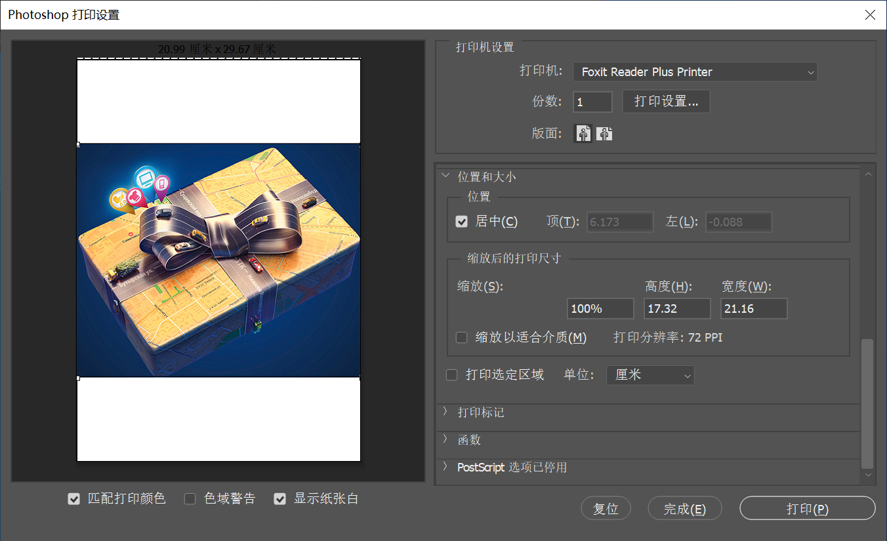
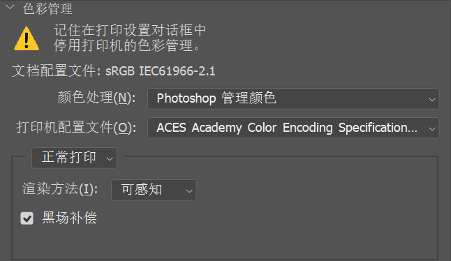
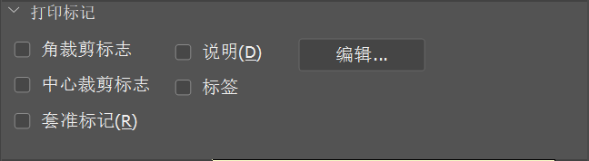
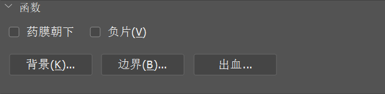

想要进行打印，首先需要设置合适的打印参数。

（1）执行 “文件 > 打印” 命令，打开 “Photoshop 打印设置” 窗口，在这里可以进行打印参数的设置。首先需要在右侧顶部设置要使用的打印机，输入打印份数，选择打印版面。单击 “打印设置” 按钮，可以在弹出的窗口中设置打印纸张的尺寸。

（2）可以在 “位置和大小” 选项组中设置文档位于打印页面的位置和缩放大小（也可以直接在左侧打印预览图中调整图像大小）。勾选 “居中” 复选框，可以将图像定位于可打印区域的中心；取消勾选 “居中” 复选框，可以在 “顶” 和 “左” 文本框中输入数值来定位图像，也可以在预览区域中移动图像来自由定位，从而打印部分图像。勾选 “缩放以适合介质” 复选框，可以自动缩放图像到合适纸张的可打印区域；取消勾选 “缩放以适合介质” 复选框，可以在 “缩放” 选项中输入图像的缩放比例，或在 “高度” 和 “宽度” 选项中设置图像的尺寸。勾选 “打印选定区域” 复选框可以启用对话框中的裁剪控制功能，调整定界框移动或缩放图像。

（3）在 “色彩管理” 选项组中，可以进行颜色的设置。

+ **颜色处理**：设置是否使用色彩管理。如果使用色彩管理，则需要确定将其应用到程序中还是打印设备中。
+ **打印机配置文件**：选择使用于打印机和将要使用的纸张类型的配置文件。
+ **渲染方法**：指定颜色从图像色彩空间转换到打印机色彩空间的方式。

（4）在 “打印标记” 选项组中可以指定页面标记。

+ **角裁剪标志：** 在要裁剪页面的位置打印裁剪标记。可以在角上打印裁剪标记。在 PostScript 打印机上，选择该选项也将打印星形靶。

+ **说明：** 打印在 “文件简介” 对话框中输入的任何说明文本（最多约 300 个字符）。

+ **中心裁剪标志：**在要裁剪页面的位置打印裁剪标志。可以在每条边的中心打印裁剪标志。
+ **标签：**在图像上方打印文件名。如果打印分色，则将分色名称作为标签的一部分进行打印。
+ **套准标记：**在图像上打印套准标记（包括靶心和星形靶）。这些标记主要用于对齐 PostScript 打印机上的分色。

（5）展开 “函数” 选项组，如下图所示。

+ **药膜朝下：**使文字在药膜朝下（即胶片或相纸上的感光层背对）时可读。在正常情况下，打印在相纸上的图像是药膜朝上打印的，感光层正对时文字可读。打印在胶片上的图像通常采用药膜朝下的方式打印。
+ **负片：**打印整个输出（包括所有蒙版和任何背景色）的反相版本。
+ **背景：**选择要在页面上的图像区域外打印的背景色。
+ **边界：**在图像周围打印一个黑色边框。
+ **出血：**在图像内而不是在图像外打印裁剪标志。

（6）全部设置完成后单击 “打印” 按钮即可打印文档，单击 “确定” 按钮会保存当前的打印设置。

（7）执行 “文件 > 打印一份” 命令，即可用设置好的打印选项快速打印当前文档。