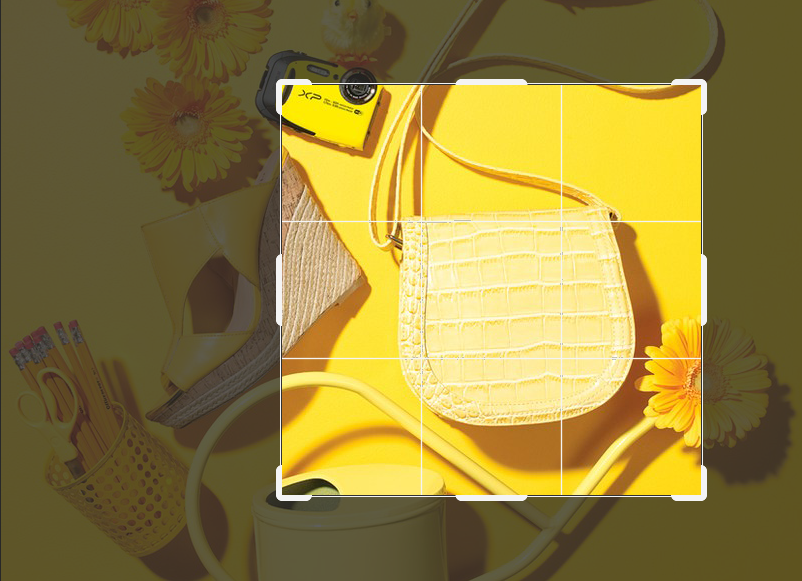
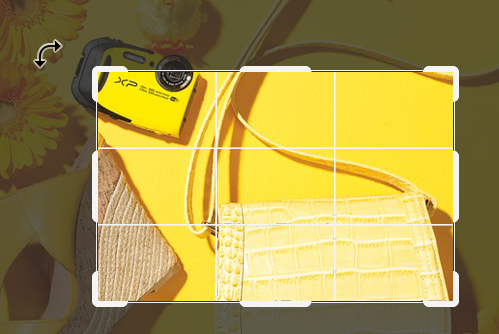
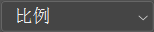

想要裁剪掉画面中的部分内容，最便捷的方法就是在工具箱中选择 `裁剪工具` 命令，直接在画面中绘制出需要保留的区域即可。

（1）单击工具箱中的 `裁剪工具`按钮，在画面中按住鼠标左键拖动，绘制一个需要保留的区域。释放鼠标后即可看到裁剪框位置发生了变化。

（2）还可以对这个区域进行调整，将光标移动到裁剪框的边缘或者四角处，按住鼠标左键拖动，即可调整裁剪框的大小。

（3）若要旋转裁剪框，可将鼠标放置在裁剪框外侧，当它变为带弧线的箭头形状时，按住鼠标左键拖动即可。调整完成后，按 <kbd>Enter</kbd> 键确认。

（4）：该下拉列表框用于设置裁剪的约束方式。如果想要按照特定比例进行裁剪，可以在该下拉列表框中选择 `比例` 选项，然后在右侧文本框中输入比例数值即可。如果想要按照特定的尺寸进行裁剪，则可以在该下拉列表框中选择 `宽 X 高 X 分辨率` 选项，在右侧文本框中输入宽、高和分辨率的数值。想要随意裁剪的时候则需要单击 `清除` 按钮，清除长宽比。

（5）在工具选项栏中单击 `拉直` 按钮，在图像上按住鼠标左键画出一条直线，松开鼠标后，即可通过将这条线校正为直线来拉直图像。

（6）如果在工具选项栏中勾选 `删除裁剪的像素` 复选框，裁剪之后会彻底删除裁剪框外部的像素数据。如果取消勾选该复选框，多余的区域将处于隐藏状态。如果想要还原到裁剪之前的画面，只需再次选择 `裁剪工具`，然后随意操作，即可看到原文档。

（7）`裁剪工具` 也能够用于放大画布。当需要放大画布时，若在选项栏中勾选 `内容识别` 复选框，然后放大画布，接着按下 <kbd>Enter</kbd> 键确认操作，稍等片刻可以发现会自动补全由于裁剪造成的画面局部空缺。

（8）若取消勾选该复选框将画布放大，被扩大的区域将被填充为背景色或为透明（当选项栏中勾选了 `删除裁剪的像素` 复选框则扩大的区域会被填充为背景色，如果为勾选该选项，扩大范围则为透明）。