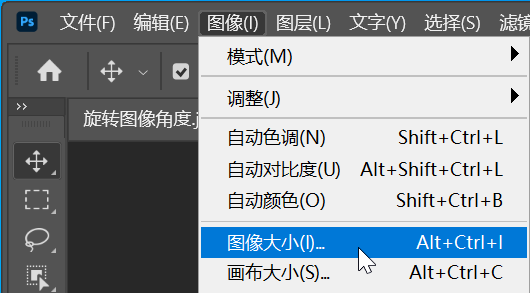
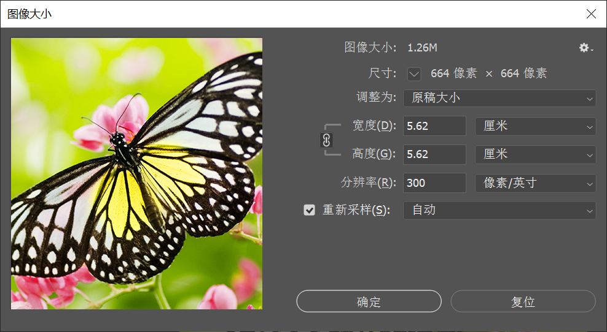

（1）要想调整图像尺寸，可以使用 `图像大小` 命令来完成。选择需要调整尺寸的图像文件，执行 `图像` -> `图像大小` 命令，打开 `图像大小` 窗口。

（2）调整图像大小时，首先要设置好正确的单位，接着在 `宽度` 和 `高度` 文本框中输入数值。默认情况下启用 `约束长宽比`  命令，修改 `宽度` 数值或 `高度` 数值时，另一个数值也会随之发生变化。该按钮用于需要将图像尺寸限定在某个特定范围内的情况。

（3）如果要输入的长宽比与现有图像的长宽比不同，则需要单击  按钮，使之处于未启用的状态。

