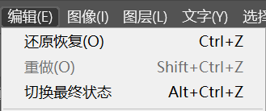

在制图过程中难免会出错，在 "编辑" 菜单下有介个命令可以进行还原与重做。单击菜单栏中的 "编辑" 按钮，即可以看到这几个命令。

（1）如果要撤销错误操作，可以执行 “编辑 > 还原画笔工具” 命令（快捷键 <kbd>Ctrl</kbd> + <kbd>Z</kbd>）。

（2）如果向要重做被撤销的操作，可以执行 “编辑 > 重做画笔工具” 命令或者使用组合键 <kbd>Shift</kbd> + <kbd>Ctrl</kbd> + <kbd>Z</kbd>。