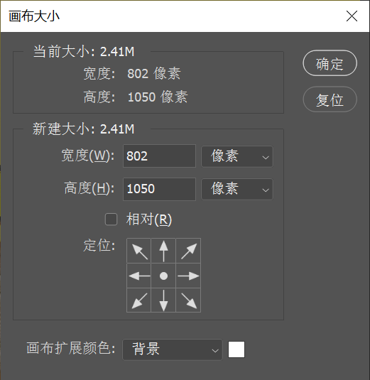

执行 `图像` -> `画布大小` 命令，在弹出的 `画布大小` 窗口中可以调整可编辑的画面范围。在 `宽度` 和 `高度` 文本框中输入数值，可以设置修改后的画布尺寸。如果选中 `相对` 复选框，`宽度` 和 `高度` 数值将代表实际增加或减少的区域的大小，而不再代表整个文档的大小。输入正值表示增加画布，输入负值表示减小画布。

+ **定位**：主要用来设置当前图像在新画布上的位置。
+ **画布扩展**：当 "新建大小" 大于 "当前大小" （即原始文档尺寸）时，在此处可以设置扩展区域的填充颜色。

> 提示："画布大小" 与 "图像大小" 的概念不同，"画布" 是指整个可以绘制的区域而非部分图像区域。例如，增大 "图像大小"，会将画面中的内容按一定比例放大；而增大 "画布大小" 则在画面中增大了部分空白区域，原始图像没有变大。如果缩小 "图像大小"，画面内容会按一定比例缩小；如果缩小 "画布大小"，图像则会被裁剪掉一部分。