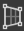
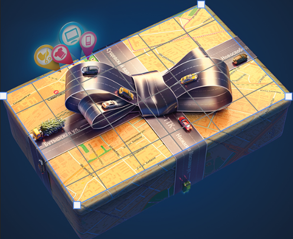
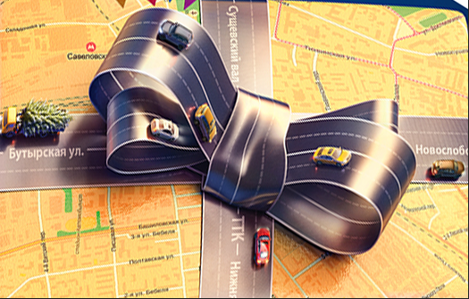

`透视裁剪工具`可以在对图像进行裁剪的同时调整图像的透视效果，常用于去除图像中的透视感，或者在带有透视感的图像中提取局部，还可以用来为图像添加透视感。例如，打开一幅带有透视感的图像，然后右击工具箱中的 `透视工具` 按钮，在弹出的工具组中选择 `透视裁剪工具`，在画面中相应位置单击，然后在下一个位置单击。接着继续在第三个位置单击。在最后一个位置单击完成透视裁剪框的绘制。按 <kbd>Enter</kbd> 键完成裁剪，可以看到原本带有透视感的画面被 "拉" 成平面了。

