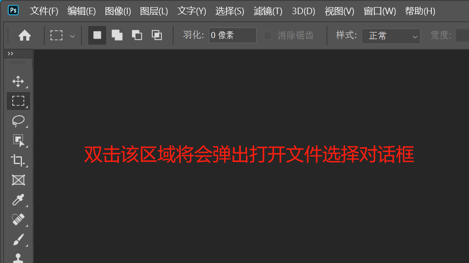

[toc]

### 方法一：

点击菜单栏中的 `文件(F)` -> ` 打开(O)...`，在弹出的对话框中，选择要打开的文件，然后点击 `打开` 按钮即可打开该文件了。

### 方法二：

直接双击工作区将会弹出文件选择对话框，选择好文件后点击 `打开` 按钮即可。

> 注意：此方法只适用于编辑区没有打开文件时才有效。

### 方法三：

直接将文件拖动到 `Photoshop` 应用界面的菜单栏附近即可打开该文件（如果当前没有打开任何文件，也可以将文件拖动到编辑区中）。

> 提示：如果当前已有打开的文件，这时将文件拖动到编辑区中，将会把该文件嵌入已打开的文件中。

### 方法四：

按下 <kbd>Ctrl</kbd>+<kbd>O</kbd> 快捷键打开文件选择对话框，选好文件后点击 `打开` 按钮即可。