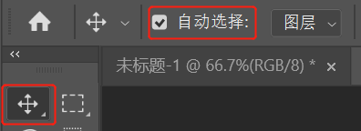

`Photoshop` 默认情况下，使用鼠标点击某个对象后将会自动选择该对象所在的图层。如果当发现点击某个对象后无法选中该对象时，需要确认选择工具的自动选择功能是否勾选上。

1. 选中选择工具 
2. 点击自动选择前面的勾选框，使其处于勾选状态。

> 提示：如果自动选择功能未勾选，也可以通过按住 <kbd>Ctrl</kbd> 键，使用鼠标点击对象可以选中该对象同时也选中该对象所在的图层。

