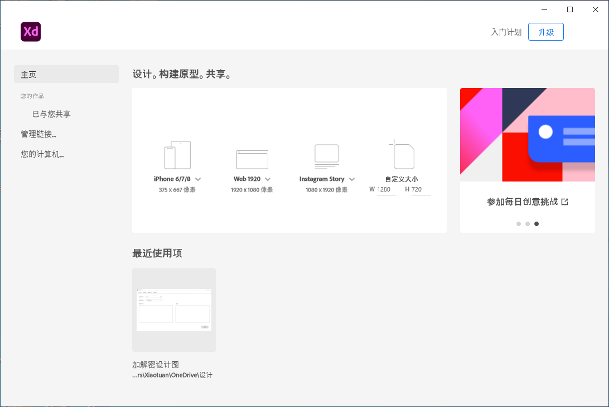
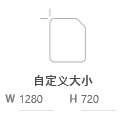
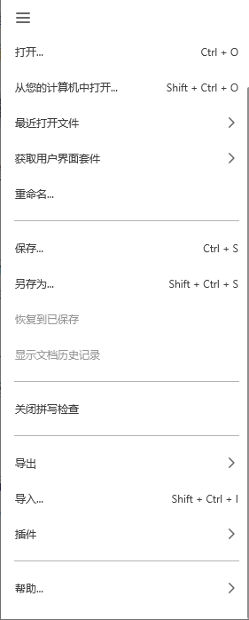
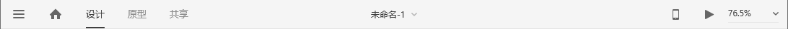
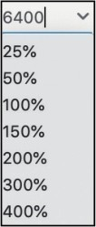

[toc]

观看在线教学视频

### 1. 启动界面

打开 XD，首先看到的是启动界面。启动界面分为左右两栏，左侧为导航，右侧为导航所对应的内容。启动界面默认打开的是主页，此时右侧对应的内容为 ”预设画板“ ”自定义大小“ ”了解基础知识“ 和 ”最近打开的文件“ 等。

点击画板名称旁的下拉箭头  可以切换画板，鼠标指针经过移动端、平板电脑端、桌面电脑网页端图标时，对应图标会变为灰色，选择好画板后单击图标，可以创建一个 XD 文件。

如果预设画板不能满足需求，可以使用 “自定义大小”，自定义画板中 W 代表的是宽度 Weight、H 代表的是高度 Height。

### 2. 菜单栏

XD 在 Mac OS 操作系统中使用的是系统菜单栏。这个菜单栏包含 "XD" "文件" "编辑" "对象" "插件" "视图" "窗口" 及 "帮助" 等多个菜单命令。

"XD" 菜单：包含 XD 的 "关于" "隐藏" "显示" 及 "退出" 等操作命令。

"文件" 菜单：包含各种文件的操作命令。

"编辑" 菜单：包含各种编辑文件的操作命令。

"对象" 菜单：包含 "编组" "对齐" 等对 XD 中对象进行操作的命令。

"插件" 菜单：包含 "使用" "查看" "管理" 及 "开发" 等对 XD 插件进行操作的命令。

"视图" 菜单：包含 "放大" "缩小" 等对视图进行设置的操作命令。

"窗口" 菜单：包含 "最小化" "缩放" 等对界面进行操作的命令。

"帮助" 菜单：包含各种帮助信息的链接。

XD 在 Windows 中的菜单被折叠，徐亚单击设计界面左上角的 "菜单" 图标  来执行打开或关闭菜单操作。

### 3. 导航栏

导航栏在设计界面的最上方，包含 "首页" 按钮 、模式切换区、文件命名区、视图大小区、原型预览区及共享区等导航命令。

"首页" 按钮：单击 "首页" 按钮  ，可以打开启动界面。

模式切换区：可对 "设计" 和 "原型" 模式进行切换。

文件命名区：显示文件名称。单击文件名称后的下拉箭头   可重命名文件、修改文件的保存位置。

视图大小区：显示当前文件缩放显示的百分比。在文本框中输入数值，可改变文件在窗口中的显示比例，可输入的最小值为 2.5%，最大值为 6400%。单击下拉箭头   ，可快速选择较为常用的百分比数值。

原型预览和共享区：该区域可将制作的原型在电脑桌面端、手机端进行预览或共享给其他人查看。

此外，双击导航栏的空白区域，可以放大或缩小窗口。(Windows 不行)