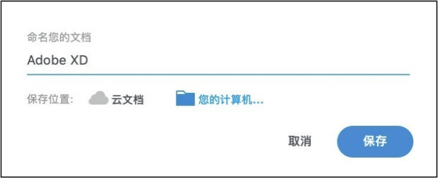
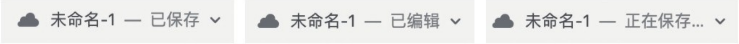
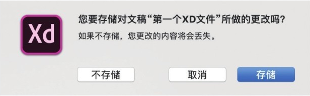

[toc]

观看在线教学视频

### 1. 文件保存

当需要将制作好的文件保存在本地计算机中时，可执行 "文件 -> 保存" 菜单命令，或使用快捷键 <kbd>Command</kbd> + <kbd>S</kbd>（Mac OS）或 <kbd>Ctrl</kbd> + <kbd>S</kbd>（Windows）进行保存。第一次执行 "文件 -> 保存" 菜单命令，或使用快捷键 <kbd>Command</kbd> + <kbd>S</kbd>（Mac OS）或 <kbd>Ctrl</kbd> + <kbd>S</kbd>（Windows）保存文件时，会从导航栏的文件名称位置弹出一个 "命名您的文档" 对话框，在对话框中可输入自定义名称，选择 "保存位置" 为 "您的计算机..."，并单击 "保存" 按钮 即可。

如果需要为文件保存副本，只需只需 "文件 -> 另存为" 菜单命令，或使用快捷键 <kbd>Command</kbd>+<kbd>Shift</kbd>+<kbd>S</kbd> （Mac OS）或 <kbd>Ctrl</kbd>+<kbd>Shift</kbd>+<kbd>S</kbd> （Windows）进行保存。

### 2. 文件保存状态

XD 中的文件有 3 种状态，分别为 "已保存" "已编辑" 和 "正在保存..."，状态会在导航栏文件名称后方显示。

**技巧提示**

需要注意的是，保存在本地计算机中的文件不会执行自动保存操作，需要执行 "文件 -> 保存" 菜单命令，或使用快捷键 <kbd>Command</kbd>+<kbd>Shift</kbd>+<kbd>S</kbd> （Mac OS）或 <kbd>Ctrl</kbd>+<kbd>Shift</kbd>+<kbd>S</kbd> （Windows）进行保存，已经选择保存位置的文件不会再有弹窗显示，状态直接显示为 "正在保存..." 状态，保存完成后显示 "以保存" 状态。

### 3. 关闭文件

执行 "文件 -> 关闭" 菜单命令，或使用快捷键 <kbd>Command</kbd>+<kbd>W</kbd>（Mac OS）或 <kbd>Ctrl</kbd>+<kbd>W</kbd>（Windows）可关闭文件。若当前文件有未保存的部分，这时会弹出提示框，单击提示框中的 "存储" 按钮，将存储对当前文件所做的更改；单击 "不存储" 按钮，对当前文件所做的更改未保存的部分将会丢失；点击 "取消" 按钮，将取消保存并继续编辑文件。

### 4. 撤销和重做

使用 XD 进行设计时，可以随时执行撤销即恢复到上一步操作，快捷键为 <kbd>Command</kbd>+<kbd>Z</kbd>（Mac OS）或 <kbd>Ctrl</kbd>+<kbd>Z</kbd>（Windows），多次使用可撤销多步。撤销后可以使用 "重做" 命令恢复撤销的内容，快捷键为 <kbd>Command</kbd>+<kbd>Shift</kbd>+<kbd>Z</kbd>（Mac OS）或 <kbd>Ctrl</kbd>+<kbd>Shift</kbd>+<kbd>Z</kbd>（Windows）。在 XD 菜单栏的 "编辑" 菜单中也可以找到 "撤销" 和 "重做" 命令来执行撤销和重做操作。