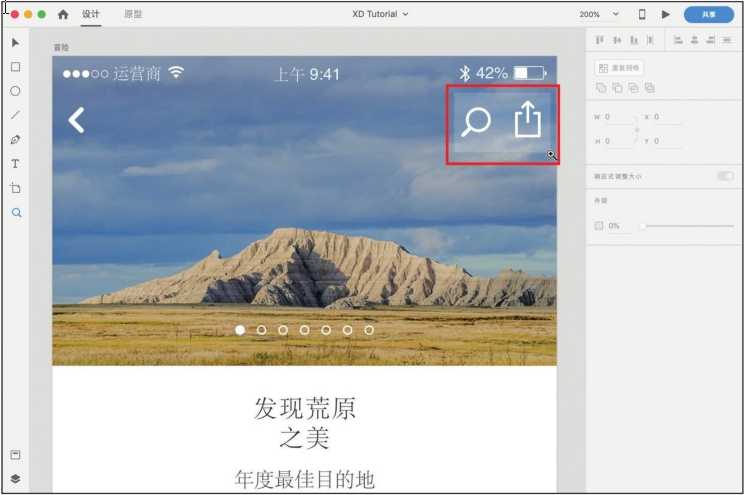
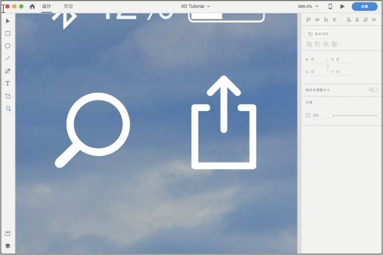
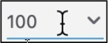

[toc]

观看在线教学视频

### 1. 放大视图显示比例

使用快捷键 <kbd>Command</kbd>+<kbd>+</kbd>（Mac OS）或 <kbd>Ctrl</kbd> + <kbd>+</kbd>（Windows）可对文件执行显示视图并依次放大的操作。

选择工具栏中的 "缩放" 工具 ，此时鼠标指针变成 "放大" 图标 ，单击画板中任意一点，视图的显示比例就会放大。

按住鼠标左键并拖动鼠标指针会出现一个选择框。松开鼠标左键，选择框内的区域会在整个设计工作区域内最大化显示。

### 2. 缩小视图显示比例

使用快捷键 <kbd>Command</kbd>+<kbd>-</kbd>（Mac OS）或 <kbd>Ctrl</kbd>+<kbd>-</kbd>（Windows）可执行显示视图并依次缩小的操作。

选择工具栏中的 "缩放" 工具   ，此时鼠标指针变为 "放大" 图标   ，

按住 <kbd>Options</kbd> （Mac OS）或 <kbd>Alt</kbd> （Windows）不放，鼠标指针变成 "缩小" 图标 ，单击画板中任意一点，视图的显示比例就会缩小。

### 3. 缩放视图至指定显示比例

在导航栏的视图显示比例数值上单击可以输入精确的数值，输入数值后按回车键或单击空白区域，可以缩放视图至指定显示比例。

单击导航栏的视图显示比例数值右侧的下拉箭头，会出现 "常用显示比例" 下拉列表。

XD支持使用快捷键将视图缩放至部分指定的显示比例，具体说明如下：

+ 快捷键 <kbd>Command</kbd>+<kbd>0</kbd>（Mac OS）或 <kbd>Ctrl</kbd>+<kbd>0</kbd>（Windows）：在视图范围内显示全部内容。
+ 快捷键<kbd>Command</kbd>+<kbd>1</kbd>（Mac OS）或 <kbd>Ctrl</kbd>+<kbd>1</kbd>（Windows）：视图以 100% 比例显示。
+ 快捷键 <kbd>Command</kbd>+<kbd>2</kbd>（Mac OS）或 <kbd>Ctrl</kbd>+<kbd>2</kbd>（Windows）：视图以 200% 比例显示。

选中设计区域中的部分内容后，按快捷键 <kbd>Command</kbd>+<kbd>3</kbd>（Mac OS）或 <kbd>Ctrl</kbd>+<kbd>3</kbd>（Windows），被选中的部分将在设计区域内以最合适且更大的比例显示。

### 4. 移动视图

在英文输入法下按住空格键，并待鼠标指针变为手的形状 后拖曳画布，可以移动视图来查看或编辑每一个区域。