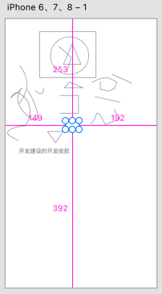
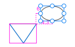

在 XD 中，选中一个矩形对象并按住 <kbd>Option</kbd> 键（Mac OS）或 <kbd>Alt</kbd> 键（Windows），XD 会自动测量距离并显示测量值。如果选中的镀锡不是矩形， XD 会在选中的对象周围绘制矩形界定框，从界定框的边界开始测量。选中多个对象时，只会绘制一个界定框。

选中任意一个对象，按住 <kbd>Option</kbd> 键并拖动鼠标指针使其经过其他对象，会显示两个对象之间距离的测量值，如下图所示：

