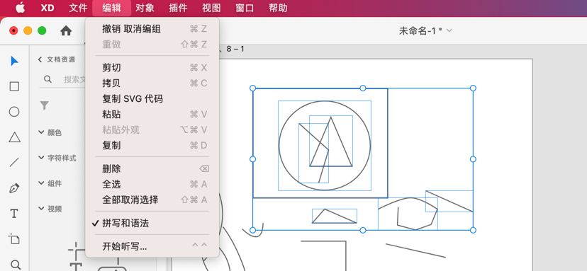
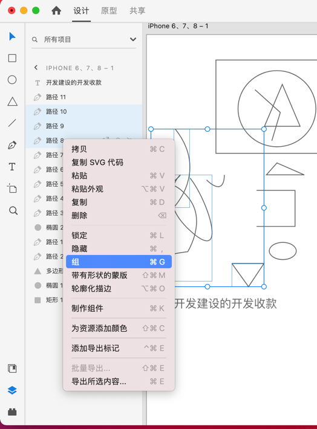
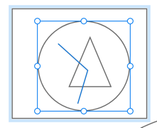

[toc]

### 1. 编组

选择要编组的对象，然后使用快捷键 <kbd>Command</kbd> + <kbd>G</kbd>（Mac OS）或 <kbd>Ctrl</kbd> + <kbd>G</kbd>（Windows）可以对对象进行编组。

### 2. 取消编组

选择已编组的对象，使用快捷键 <kbd>Command</kbd> + <kbd>Shift</kbd> + <kbd>G</kbd> （Mac OS）或 <kbd>Ctrl</kbd> + <kbd>Shift</kbd> + <kbd>G</kbd>（Windows）可以取消编组。

### 3. 使用鼠标编组或取消编组

选择需要编组或取消编组的对象，单击鼠标右键，可以根据需要选择编组或取消编组。

### 4. 使用菜单编组或取消编组

在 Mac OS 操作系统上，从 XD 的菜单 “对象” 的子菜单中也可以进行编组或取消编组。

### 5. 在图层面板中编组或取消编组

在 “图层” 面板中也可以选择对象进行编组或取消编组。

### 6. 选中编组内对象

需要选中组中的对象，选择组后双击可以进入组的内部进行选择，按住 <kbd>Command</kbd> 键（Mac OS）或 <kbd>Ctrl</kbd> 键（Windows）并单击对象，可以快速选择组内部的对象。

